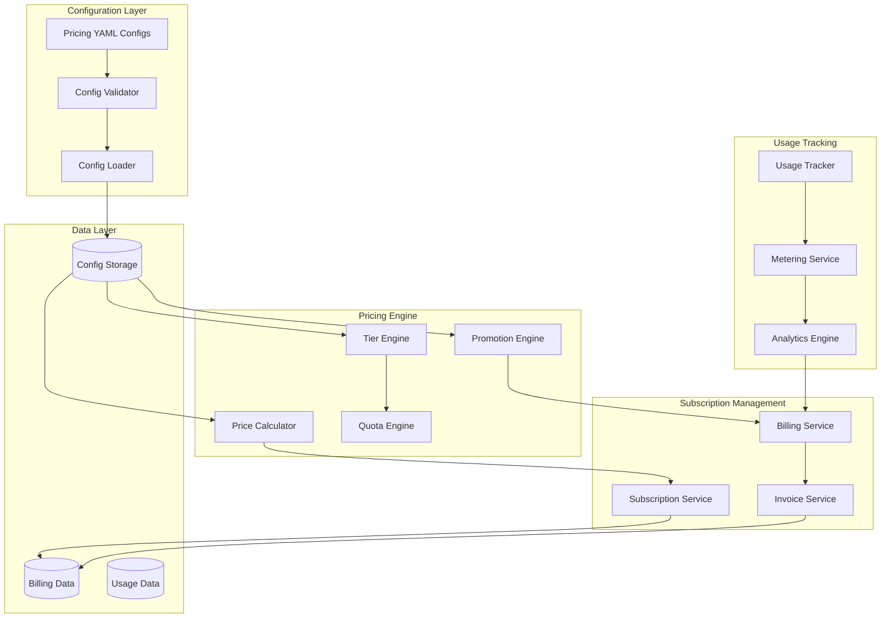

# Config-Driven Pricing Model Architecture

## Overview

This document outlines the architecture for a flexible, configuration-driven pricing and subscription system for the Veil API marketplace. The system supports multiple pricing strategies, usage-based billing, subscription tiers, and promotional pricing - all configurable through external configuration files.

## 1. Pricing Model Architecture

### 1.1 System Components Overview



### 1.2 Configuration Schema Design

```yaml
# pricing-config.yaml
pricing_models:
  # Usage-based pricing with tiers
  - id: "weather-api-tiered"
    name: "Weather API - Tiered Pricing"
    type: "usage_based"
    billing_cycle: "monthly"
    currency: "USD"

    tiers:
      - name: "starter"
        limit: 1000
        price_per_unit: 0.001
        base_fee: 0.00
      - name: "professional"
        limit: 10000
        price_per_unit: 0.0008
        base_fee: 5.00
      - name: "enterprise"
        limit: 100000
        price_per_unit: 0.0005
        base_fee: 25.00
      - name: "unlimited"
        limit: null
        price_per_unit: 0.0003
        base_fee: 100.00

    # Overage pricing when limits exceeded
    overage:
      enabled: true
      price_per_unit: 0.002
      grace_requests: 100

    # Quota management
    quotas:
      requests_per_hour: 1000
      requests_per_day: 10000
      data_transfer_gb: 50
      concurrent_requests: 10

  # Flat subscription pricing
  - id: "premium-api-flat"
    name: "Premium API - Flat Rate"
    type: "subscription"
    billing_cycle: "monthly"
    currency: "USD"
    base_price: 99.99

    included_usage:
      requests: 100000
      data_transfer_gb: 500

    overage:
      enabled: true
      requests_price_per_unit: 0.0005
      data_price_per_gb: 2.00

  # Freemium model
  - id: "demo-api-freemium"
    name: "Demo API - Freemium"
    type: "freemium"
    billing_cycle: "monthly"
    currency: "USD"

    free_tier:
      requests: 1000
      data_transfer_gb: 1
      features: ["basic_endpoints"]

    premium_tiers:
      - name: "pro"
        price: 19.99
        requests: 50000
        data_transfer_gb: 50
        features: ["basic_endpoints", "advanced_endpoints", "analytics"]

# Promotion rules
promotions:
  - id: "new-user-discount"
    name: "New User 50% Off First Month"
    type: "percentage_discount"
    value: 50
    duration_months: 1
    conditions:
      - type: "first_subscription"
      - type: "user_created_after"
        value: "2024-01-01"

  - id: "enterprise-bulk-discount"
    name: "Enterprise Volume Discount"
    type: "tier_upgrade"
    conditions:
      - type: "usage_threshold"
        metric: "monthly_requests"
        value: 1000000
    action:
      type: "apply_tier"
      tier: "enterprise"
      discount_percentage: 20

# Global settings
settings:
  billing_grace_period_days: 7
  usage_calculation_precision: 6
  prorated_billing: true
  tax_calculation: "inclusive"
  currency_conversion: true
  default_currency: "USD"
```

## 2. Core Implementation

### 2.1 Pricing Configuration Engine

```typescript
export interface PricingModel {
  id: string;
  name: string;
  type: 'usage_based' | 'subscription' | 'freemium' | 'hybrid';
  billingCycle: 'daily' | 'weekly' | 'monthly' | 'yearly';
  currency: string;
  tiers?: PricingTier[];
  basePrice?: number;
  includedUsage?: UsageAllocation;
  overage?: OverageConfig;
  quotas?: QuotaConfig;
}

export interface PricingTier {
  name: string;
  limit: number | null; // null = unlimited
  pricePerUnit: number;
  baseFee: number;
  features?: string[];
}

export class PricingConfigurationService {
  private configCache = new Map<string, PricingModel>();

  async loadPricingConfigs(): Promise<void> {
    try {
      // Load from YAML files
      const configFiles = await this.getConfigFiles();

      for (const file of configFiles) {
        const config = await this.parseYAMLConfig(file);
        await this.validateConfig(config);

        // Store in cache and database
        for (const model of config.pricing_models) {
          this.configCache.set(model.id, model);
          await this.storePricingModel(model);
        }
      }
    } catch (error) {
      throw new ConfigurationError('Failed to load pricing configs', error);
    }
  }

  async getPricingModel(modelId: string): Promise<PricingModel> {
    // Try cache first
    if (this.configCache.has(modelId)) {
      return this.configCache.get(modelId)!;
    }

    // Fallback to database
    const model = await this.pricingRepository.findById(modelId);
    if (!model) {
      throw new NotFoundError(`Pricing model ${modelId} not found`);
    }

    this.configCache.set(modelId, model);
    return model;
  }

  private async validateConfig(config: any): Promise<void> {
    const schema = await this.loadJsonSchema('pricing-config.schema.json');
    const validator = new Ajv();

    if (!validator.validate(schema, config)) {
      throw new ValidationError('Invalid pricing configuration', validator.errors);
    }

    // Business logic validation
    for (const model of config.pricing_models) {
      await this.validateBusinessRules(model);
    }
  }
}
```

### 2.2 Price Calculation Engine

```typescript
export class PriceCalculationEngine {
  constructor(
    private configService: PricingConfigurationService,
    private promotionEngine: PromotionEngine,
    private usageService: UsageService
  ) {}

  async calculatePrice(
    subscription: Subscription,
    usage: UsageData,
    billingPeriod: BillingPeriod
  ): Promise<PriceCalculation> {
    const pricingModel = await this.configService.getPricingModel(
      subscription.pricingModelId
    );

    let calculation: PriceCalculation;

    switch (pricingModel.type) {
      case 'usage_based':
        calculation = await this.calculateUsageBasedPrice(pricingModel, usage);
        break;
      case 'subscription':
        calculation = await this.calculateSubscriptionPrice(pricingModel, usage);
        break;
      case 'freemium':
        calculation = await this.calculateFreemiumPrice(pricingModel, usage);
        break;
      case 'hybrid':
        calculation = await this.calculateHybridPrice(pricingModel, usage);
        break;
    }

    // Apply promotions
    const promotions = await this.promotionEngine.getApplicablePromotions(
      subscription,
      usage,
      billingPeriod
    );

    for (const promotion of promotions) {
      calculation = await this.applyPromotion(calculation, promotion);
    }

    // Add taxes if applicable
    calculation = await this.addTaxes(calculation, subscription);

    return calculation;
  }

  private async calculateUsageBasedPrice(
    model: PricingModel,
    usage: UsageData
  ): Promise<PriceCalculation> {
    const calculation: PriceCalculation = {
      baseAmount: 0,
      usageAmount: 0,
      overageAmount: 0,
      totalBeforeTax: 0,
      taxAmount: 0,
      totalAmount: 0,
      breakdown: []
    };

    const requestsUsed = usage.totalRequests;
    let remainingRequests = requestsUsed;
    let currentTierIndex = 0;

    // Calculate tiered pricing
    for (const tier of model.tiers || []) {
      if (remainingRequests <= 0) break;

      const tierLimit = tier.limit || Infinity;
      const requestsInTier = Math.min(remainingRequests, tierLimit);
      const tierCost = requestsInTier * tier.pricePerUnit + tier.baseFee;

      calculation.baseAmount += tier.baseFee;
      calculation.usageAmount += requestsInTier * tier.pricePerUnit;
      calculation.breakdown.push({
        tier: tier.name,
        requests: requestsInTier,
        rate: tier.pricePerUnit,
        baseFee: tier.baseFee,
        amount: tierCost
      });

      remainingRequests -= requestsInTier;
      currentTierIndex++;
    }

    // Calculate overage if enabled
    if (remainingRequests > 0 && model.overage?.enabled) {
      const graceRequests = model.overage.grace_requests || 0;
      const overageRequests = Math.max(0, remainingRequests - graceRequests);

      if (overageRequests > 0) {
        calculation.overageAmount = overageRequests * model.overage.price_per_unit;
        calculation.breakdown.push({
          tier: 'overage',
          requests: overageRequests,
          rate: model.overage.price_per_unit,
          amount: calculation.overageAmount
        });
      }
    }

    calculation.totalBeforeTax =
      calculation.baseAmount + calculation.usageAmount + calculation.overageAmount;
    calculation.totalAmount = calculation.totalBeforeTax;

    return calculation;
  }

  private async calculateSubscriptionPrice(
    model: PricingModel,
    usage: UsageData
  ): Promise<PriceCalculation> {
    const calculation: PriceCalculation = {
      baseAmount: model.basePrice || 0,
      usageAmount: 0,
      overageAmount: 0,
      totalBeforeTax: model.basePrice || 0,
      taxAmount: 0,
      totalAmount: model.basePrice || 0,
      breakdown: [{
        tier: 'base_subscription',
        amount: model.basePrice || 0,
        description: 'Monthly subscription fee'
      }]
    };

    // Calculate overages
    if (model.overage?.enabled) {
      const includedRequests = model.includedUsage?.requests || 0;
      const overageRequests = Math.max(0, usage.totalRequests - includedRequests);

      if (overageRequests > 0) {
        calculation.overageAmount = overageRequests * model.overage.requests_price_per_unit;
        calculation.breakdown.push({
          tier: 'request_overage',
          requests: overageRequests,
          rate: model.overage.requests_price_per_unit,
          amount: calculation.overageAmount
        });
      }

      // Data transfer overage
      const includedDataGB = model.includedUsage?.data_transfer_gb || 0;
      const overageDataGB = Math.max(0, usage.dataTransferGB - includedDataGB);

      if (overageDataGB > 0) {
        const dataOverageAmount = overageDataGB * model.overage.data_price_per_gb;
        calculation.overageAmount += dataOverageAmount;
        calculation.breakdown.push({
          tier: 'data_overage',
          dataGB: overageDataGB,
          rate: model.overage.data_price_per_gb,
          amount: dataOverageAmount
        });
      }
    }

    calculation.totalBeforeTax += calculation.overageAmount;
    calculation.totalAmount = calculation.totalBeforeTax;

    return calculation;
  }
}
```

### 2.3 Subscription Management with Dynamic Pricing

```typescript
export class AdvancedSubscriptionService {
  constructor(
    private pricingEngine: PriceCalculationEngine,
    private billingService: BillingService,
    private quotaService: QuotaService
  ) {}

  async createSubscription(
    userId: number,
    apiUid: string,
    pricingModelId: string,
    customizations?: SubscriptionCustomizations
  ): Promise<Subscription> {
    const api = await this.apiRepository.findByUid(apiUid);
    if (!api) {
      throw new NotFoundError('API not found');
    }

    const pricingModel = await this.pricingEngine.configService.getPricingModel(
      pricingModelId
    );

    // Create subscription with dynamic pricing
    const subscription = await this.database.transaction(async (trx) => {
      const sub = await this.subscriptionRepository.create({
        userId,
        apiId: api.id,
        pricingModelId,
        status: 'active',
        billingCycle: pricingModel.billingCycle,
        customizations: customizations || {}
      }, trx);

      // Set up quotas based on pricing model
      await this.quotaService.initializeQuotas(sub.id, pricingModel, trx);

      // Create initial billing period
      await this.billingService.createBillingPeriod(sub.id, pricingModel, trx);

      return sub;
    });

    // Generate API keys
    const apiKey = await this.apiKeyService.createAPIKey(userId, {
      subscriptionUid: subscription.uid,
      name: `${api.name} Key`,
      expiresAt: this.calculateKeyExpiry(pricingModel)
    });

    return {
      ...subscription,
      apiKey
    };
  }

  async upgradeSubscription(
    subscriptionUid: string,
    newPricingModelId: string
  ): Promise<SubscriptionUpgrade> {
    const subscription = await this.subscriptionRepository.findByUid(subscriptionUid);
    if (!subscription) {
      throw new NotFoundError('Subscription not found');
    }

    const newPricingModel = await this.pricingEngine.configService.getPricingModel(
      newPricingModelId
    );

    return this.database.transaction(async (trx) => {
      // Calculate prorated amount for current period
      const currentUsage = await this.usageService.getCurrentPeriodUsage(subscription.id);
      const remainingDays = await this.billingService.getRemainingDays(subscription);

      const prorationCredit = await this.calculateProrationCredit(
        subscription,
        currentUsage,
        remainingDays
      );

      // Update subscription
      await this.subscriptionRepository.update(subscription.id, {
        pricingModelId: newPricingModelId,
        upgradedAt: new Date()
      }, trx);

      // Update quotas
      await this.quotaService.updateQuotas(subscription.id, newPricingModel, trx);

      // Handle billing transition
      const billingAdjustment = await this.billingService.handleUpgrade(
        subscription,
        newPricingModel,
        prorationCredit,
        trx
      );

      return {
        subscription,
        newPricingModel,
        billingAdjustment,
        effectiveDate: new Date()
      };
    });
  }
}
```

### 2.4 Promotion Engine

```typescript
export class PromotionEngine {
  async getApplicablePromotions(
    subscription: Subscription,
    usage: UsageData,
    billingPeriod: BillingPeriod
  ): Promise<Promotion[]> {
    const allPromotions = await this.promotionRepository.findActive();
    const applicablePromotions: Promotion[] = [];

    for (const promotion of allPromotions) {
      if (await this.isPromotionApplicable(promotion, subscription, usage, billingPeriod)) {
        applicablePromotions.push(promotion);
      }
    }

    // Sort by priority and return
    return applicablePromotions.sort((a, b) => b.priority - a.priority);
  }

  private async isPromotionApplicable(
    promotion: Promotion,
    subscription: Subscription,
    usage: UsageData,
    billingPeriod: BillingPeriod
  ): Promise<boolean> {
    for (const condition of promotion.conditions) {
      switch (condition.type) {
        case 'first_subscription':
          const isFirstSubscription = await this.checkFirstSubscription(subscription.userId);
          if (!isFirstSubscription) return false;
          break;

        case 'usage_threshold':
          const meetsThreshold = await this.checkUsageThreshold(
            subscription,
            condition.metric,
            condition.value
          );
          if (!meetsThreshold) return false;
          break;

        case 'user_created_after':
          const userCreatedAfter = await this.checkUserCreatedAfter(
            subscription.userId,
            condition.value
          );
          if (!userCreatedAfter) return false;
          break;

        case 'api_category':
          if (subscription.api.categoryId !== condition.value) return false;
          break;

        // Add more condition types as needed
      }
    }

    return true;
  }

  async applyPromotion(
    calculation: PriceCalculation,
    promotion: Promotion
  ): Promise<PriceCalculation> {
    const updatedCalculation = { ...calculation };

    switch (promotion.type) {
      case 'percentage_discount':
        const discountAmount = (calculation.totalBeforeTax * promotion.value) / 100;
        updatedCalculation.discountAmount = (updatedCalculation.discountAmount || 0) + discountAmount;
        updatedCalculation.totalAmount -= discountAmount;
        break;

      case 'fixed_discount':
        const fixedDiscount = Math.min(promotion.value, calculation.totalBeforeTax);
        updatedCalculation.discountAmount = (updatedCalculation.discountAmount || 0) + fixedDiscount;
        updatedCalculation.totalAmount -= fixedDiscount;
        break;

      case 'free_tier_upgrade':
        // Implementation depends on specific promotion logic
        break;
    }

    updatedCalculation.appliedPromotions = [
      ...(updatedCalculation.appliedPromotions || []),
      {
        id: promotion.id,
        name: promotion.name,
        type: promotion.type,
        discountAmount: promotion.type === 'percentage_discount'
          ? (calculation.totalBeforeTax * promotion.value) / 100
          : promotion.value
      }
    ];

    return updatedCalculation;
  }
}
```

## 3. Usage-Based Billing Integration

### 3.1 Metering and Aggregation Service

```typescript
export class MeteringService {
  async recordUsage(
    subscriptionId: number,
    usageEvent: UsageEvent
  ): Promise<void> {
    // Real-time usage recording
    await this.database.transaction(async (trx) => {
      // Insert detailed usage record
      await this.usageRepository.recordEvent(subscriptionId, usageEvent, trx);

      // Update aggregated metrics
      await this.updateAggregatedMetrics(subscriptionId, usageEvent, trx);

      // Check quotas in real-time
      await this.quotaService.checkAndEnforceQuotas(subscriptionId, trx);
    });

    // Update billing cache
    await this.updateBillingCache(subscriptionId, usageEvent);
  }

  async aggregateUsageForBilling(
    subscriptionId: number,
    billingPeriod: BillingPeriod
  ): Promise<AggregatedUsage> {
    const usage = await this.usageRepository.aggregateForPeriod(
      subscriptionId,
      billingPeriod.startDate,
      billingPeriod.endDate
    );

    return {
      subscriptionId,
      billingPeriodId: billingPeriod.id,
      totalRequests: usage.totalRequests,
      successfulRequests: usage.successfulRequests,
      failedRequests: usage.failedRequests,
      dataTransferGB: usage.totalDataTransfer / (1024 * 1024 * 1024),
      uniqueDays: usage.uniqueDays,
      peakHourlyRequests: usage.maxHourlyRequests,
      averageResponseTime: usage.avgResponseTime
    };
  }
}
```

## 4. Billing and Invoicing

### 4.1 Automated Billing Service

```typescript
export class AutomatedBillingService {
  async processBillingCycle(): Promise<BillingCycleResult> {
    const results = { processed: 0, succeeded: 0, failed: 0, errors: [] };

    // Find subscriptions due for billing
    const subscriptionsDue = await this.subscriptionRepository.findDueForBilling();

    for (const subscription of subscriptionsDue) {
      try {
        await this.processBillingForSubscription(subscription);
        results.succeeded++;
      } catch (error) {
        results.failed++;
        results.errors.push({
          subscriptionId: subscription.id,
          error: error.message
        });
      }
      results.processed++;
    }

    return results;
  }

  private async processBillingForSubscription(subscription: Subscription): Promise<void> {
    const billingPeriod = await this.billingService.getCurrentBillingPeriod(subscription.id);

    // Get usage data for the period
    const usage = await this.meteringService.aggregateUsageForBilling(
      subscription.id,
      billingPeriod
    );

    // Calculate the price
    const calculation = await this.pricingEngine.calculatePrice(
      subscription,
      usage,
      billingPeriod
    );

    // Generate invoice
    const invoice = await this.invoiceService.createInvoice({
      subscriptionId: subscription.id,
      billingPeriodId: billingPeriod.id,
      calculation,
      usage,
      dueDate: new Date(Date.now() + 30 * 24 * 60 * 60 * 1000) // 30 days
    });

    // Process payment
    await this.paymentService.processPayment(invoice);

    // Send invoice to customer
    await this.notificationService.sendInvoice(subscription.user, invoice);
  }
}
```

## 5. Configuration Management

### 5.1 Hot-Reload Configuration System

```typescript
export class ConfigurationManager {
  private configWatcher: FileWatcher;
  private eventEmitter = new EventEmitter();

  async initialize(): Promise<void> {
    // Load initial configurations
    await this.loadAllConfigurations();

    // Set up file watchers for hot-reload
    this.configWatcher = new FileWatcher('./config/pricing');
    this.configWatcher.on('change', async (file) => {
      await this.reloadConfiguration(file);
    });
  }

  private async reloadConfiguration(configFile: string): Promise<void> {
    try {
      const config = await this.parseYAMLConfig(configFile);
      await this.validateConfig(config);

      // Update in-memory cache
      await this.updateCache(config);

      // Notify services of configuration change
      this.eventEmitter.emit('config_updated', {
        file: configFile,
        config: config,
        timestamp: new Date()
      });

    } catch (error) {
      // Log error but don't crash - keep using existing config
      console.error(`Failed to reload config ${configFile}:`, error);
    }
  }

  async updatePricingModel(modelId: string, updates: Partial<PricingModel>): Promise<void> {
    // Update in database
    await this.pricingRepository.update(modelId, updates);

    // Update cache
    const existingModel = this.configCache.get(modelId);
    if (existingModel) {
      this.configCache.set(modelId, { ...existingModel, ...updates });
    }

    // Notify subscribers
    this.eventEmitter.emit('pricing_model_updated', {
      modelId,
      updates,
      timestamp: new Date()
    });
  }
}
```

This comprehensive pricing architecture provides a flexible, scalable foundation for supporting diverse business models while maintaining operational efficiency and customer satisfaction.