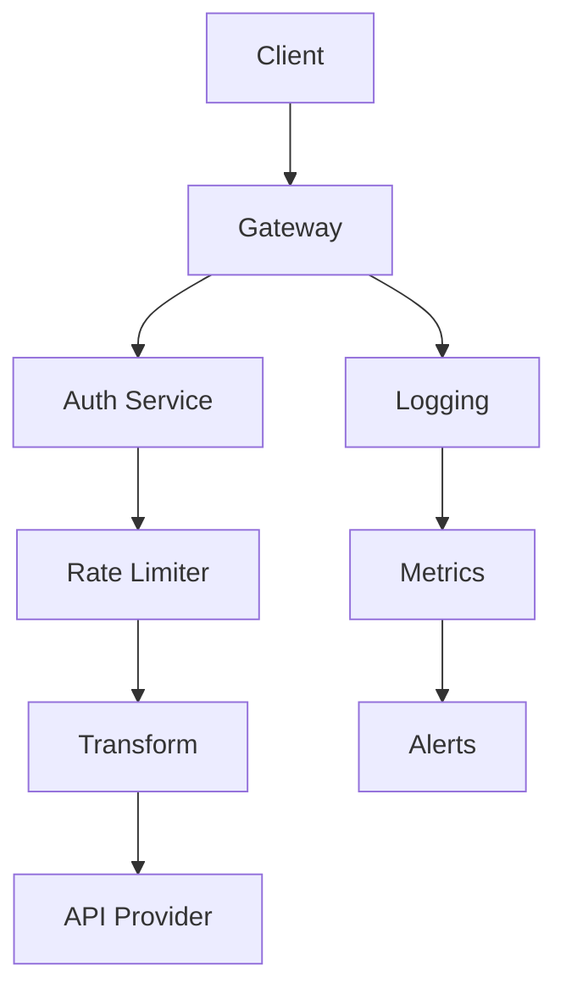
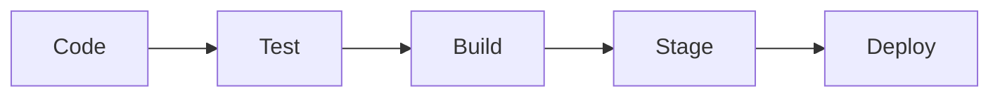
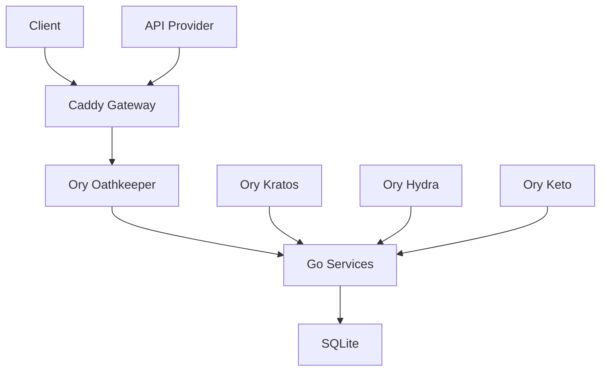
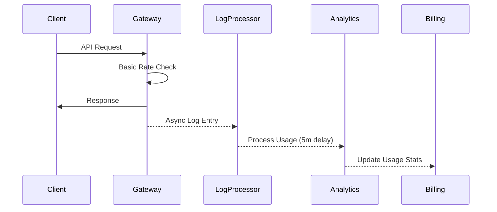
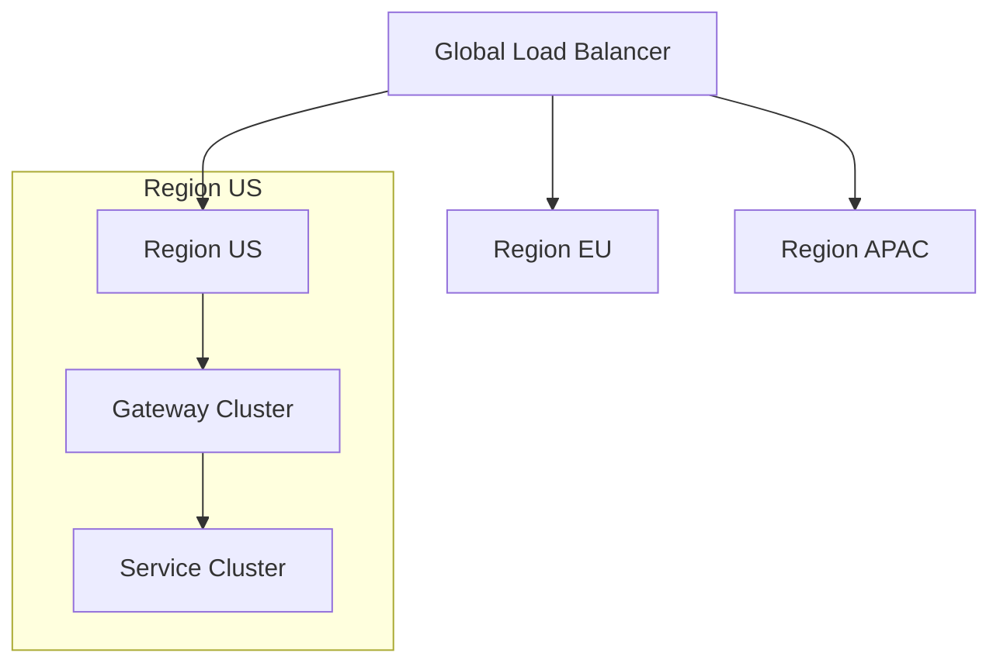

# Veil Architecture Design Document

## Overview

Veil is an API marketplace platform that enables API providers to publish their APIs and allows consumers to discover, subscribe to, and manage API access through a unified gateway.

## Core Components

### 1. Gateway Layer (Caddy-based)

#### Components

- **Authentication Middleware**: Validates API keys and JWT tokens
- **Rate Limiting**: Enforces usage quotas and throttling
- **Request Transform**: Handles header manipulation and request routing
- **Logging**: Captures detailed request/response metrics
- **Health Check**: Monitors API endpoint availability

#### Key Features

- Real-time request validation
- Automatic header transformation
- Traffic shaping and throttling
- Request/response logging
- Error handling and retry logic

### 2. Platform Core

#### Services

- **API Management**

  - Onboarding service
  - Validation service
  - Update service
  - Deletion service
  - Version management

- **User Management**

  - Authentication service
  - Authorization service
  - Profile management
  - API key management

- **Subscription Management**
  - Plan management
  - Quota tracking
  - Usage analytics
  - Billing integration

#### Data Store

- **SQLite Database**
  - User data
  - API configurations
  - Subscription data
  - Usage metrics
  - Audit logs

### 3. Observability Stack

#### Components

- **Logging (Loki)**

  - Request/response logs
  - Error logs
  - Audit logs
  - Performance metrics

- **Metrics (Prometheus)**

  - Usage statistics
  - Performance metrics
  - Error rates
  - Response times

- **Visualization (Grafana)**
  - Usage dashboards
  - Performance monitoring
  - Alerting
  - Trend analysis

## System Architecture

### Request Flow

1. **Client Request**

   ```
   Client -> Gateway -> Auth -> Rate Limit -> Transform -> API
   ```

2. **Response Flow**

   ```
   API -> Transform -> Logging -> Metrics -> Client
   ```

3. **Error Flow**
   ```
   Error -> Error Handler -> Logging -> Metrics -> Client
   ```

### Data Flow



## Security Architecture

### Authentication

1. **API Key Authentication**

   - Format: `veil_live_[base58]`
   - Rotation policy: 90 days
   - Scope-based access control

2. **JWT Tokens**
   - Short-lived (1 hour)
   - Refresh token support
   - Role-based access control

### Authorization

1. **Scopes**

   ```json
   {
     "api:read": "Read API metadata",
     "api:write": "Modify API configuration",
     "keys:manage": "Manage API keys",
     "usage:read": "View usage statistics"
   }
   ```

2. **Roles**
   - API Provider
   - API Consumer
   - Administrator
   - Billing Manager

### Data Protection

1. **At Rest**

   - Database encryption
   - Sensitive field encryption
   - Key rotation

2. **In Transit**
   - TLS 1.3 required
   - Certificate pinning
   - Perfect forward secrecy

## Scalability Design

Veil's architecture is designed for horizontal scalability across all components. The gateway layer employs a stateless design that allows for seamless scaling through load balancers and regional deployments. This approach enables the platform to handle increasing traffic loads by simply adding more gateway instances.

### Gateway Configuration Management

Veil takes a unique approach to Caddy configuration management, treating configuration as versioned, immutable objects. Each API's gateway configuration is stored as an individual JSON file, enabling granular updates and efficient change tracking:

```json
{
  "configVersion": "2024.1",
  "apiId": "api_123",
  "routes": {
    "handle": [
      {
        "handler": "subroute",
        "routes": [
          {
            "handle": [
              {
                "handler": "reverse_proxy",
                "upstreams": [{ "dial": "api.provider.com:443" }],
                "headers": {
                  "request": {
                    "set": {
                      "Authorization": ["{http.request.header.X-Api-Key}"]
                    }
                  }
                }
              }
            ]
          }
        ]
      }
    ]
  }
}
```

Configuration changes are managed through a delta-based system:

1. New configurations are stored as separate JSON files
2. Only changed routes are updated in Caddy
3. Version history is maintained for rollback capability
4. Configurations are validated before deployment

The platform uses an S3-compatible storage system for configuration management:

```
s3://veil-config/
  ├── apis/
  │   ├── api_123/
  │   │   ├── v1/config.json
  │   │   ├── v2/config.json
  │   │   └── current -> v2/config.json
  │   └── api_456/
  │       └── v1/config.json
  ├── global/
  │   └── middleware/
  │       ├── auth.json
  │       └── metrics.json
  └── versions.lock
```

This approach provides several benefits:

- Atomic updates to individual API configurations
- Easy rollback to previous versions
- Efficient diff-based change detection
- Improved debugging through version history
- Configuration auditability

### Horizontal Scaling

1. **Gateway Layer**

   - Stateless design
   - Load balancer support
   - Regional deployment

2. **Platform Layer**
   - Microservices architecture
   - Independent scaling
   - Resource isolation

### Performance Optimization

1. **Caching Strategy**

   ```json
   {
     "apiConfig": { "ttl": "5m" },
     "authTokens": { "ttl": "1m" },
     "rateLimits": { "ttl": "1s" }
   }
   ```

2. **Rate Limiting**
   - Token bucket algorithm
   - Distributed rate limiting
   - Burst handling

## Monitoring and Alerting

### Key Metrics

1. **Platform Health**

   - Gateway latency
   - Error rates
   - CPU/Memory usage
   - Database connections

2. **Business Metrics**
   - Active subscriptions
   - API usage
   - Revenue
   - Customer satisfaction

### Alert Thresholds

```json
{
  "critical": {
    "errorRate": ">5%",
    "latency": ">500ms",
    "availability": "<99.9%"
  },
  "warning": {
    "errorRate": ">1%",
    "latency": ">200ms",
    "availability": "<99.95%"
  }
}
```

## Disaster Recovery

### Backup Strategy

1. **Database**

   - Full backup: Daily
   - Incremental: Hourly
   - Retention: 90 days

2. **Configuration**
   - Version controlled
   - Infrastructure as Code
   - Automated recovery

### Recovery Procedures

1. **Gateway Failure**

   - Automatic failover
   - Regional redundancy
   - Blue-green deployment

2. **Data Recovery**
   - Point-in-time recovery
   - Cross-region replication
   - Automated verification

## Development Workflow

### CI/CD Pipeline



### Testing Strategy

1. **Unit Tests**

   - Service layer
   - Data access
   - Utilities

2. **Integration Tests**

   - API endpoints
   - Gateway configuration
   - Authentication flow

3. **Performance Tests**
   - Load testing
   - Stress testing
   - Failover scenarios

## Future Roadmap

### Phase 1: Core Platform

- Gateway implementation
- Basic API management
- Usage tracking

### Phase 2: Enhanced Features

- Advanced analytics
- Billing integration
- Documentation portal

### Phase 3: Enterprise Features

- Multi-region support
- Custom domains
- SSO integration

## References

1. [Sequence Diagrams](./seq-dig/)
2. [Architecture Diagram](./arch.mmd)
3. [API Documentation](../api/)
4. [Deployment Guide](../deployment/)

## Technology Stack

### Core Technologies

1. **Backend**

   - **Go**

     - Primary development language
     - Native integration with Caddy
     - High performance and concurrency
     - Strong type system
     - Built-in testing support

   - **Caddy**
     - Core gateway implementation
     - Custom middleware development
     - Native HTTPS support
     - Dynamic configuration
     - High performance proxy

2. **Authentication & Authorization**

   - **Ory Stack**
     - Kratos: Identity management
     - Hydra: OAuth2 & OpenID Connect
     - Oathkeeper: Zero-trust networking
     - Keto: Fine-grained permissions

3. **Data Storage**

   - **SQLite**
     - Embedded database
     - ACID compliance
     - Zero configuration
     - Single file storage
     - Serverless operation

### Component Integration



### Development Tools

1. **Build & Development**

   - Go 1.23+
   - Air (Live reload)

2. **Testing**
   - Go testing framework
   - Testcontainers
   - k6 (Performance testing)
   - Newman (API testing)

### Infrastructure

1. **Container Runtime**

   - Docker
   - Docker Compose (development)
   - Kubernetes (production)

2. **Service Mesh**
   - Istio
     - Traffic management
     - Security policies
     - Observability

### Technology Selection Criteria

1. **Go**

   - Native Caddy integration capabilities
   - Strong standard library
   - Excellent performance characteristics
   - Built-in concurrency support
   - Simple deployment (single binary)
   - Strong community and ecosystem

2. **Ory.sh**

   - Enterprise-grade security
   - OAuth2 and OIDC compliance
   - Zero-trust architecture
   - Cloud-native design
   - Active development and community
   - Comprehensive documentation

3. **SQLite**
   - Simplified operations
   - No separate database server
   - Excellent performance for our scale
   - Easy backup and recovery
   - Native Go support

## Consistency Model

Veil employs a hybrid consistency model that prioritizes user experience while maintaining system reliability. At its core, the platform makes a deliberate trade-off between immediate consistency for critical operations and eventual consistency for analytical and billing functions.

### Real-time vs. Delayed Operations

Critical path operations such as API key validation, authentication checks, and per-second rate limiting are processed with immediate consistency. These operations happen directly in the gateway layer, ensuring minimal latency and maximum reliability for API consumers. Every request is validated in real-time before being proxied to the provider's API.

However, for usage tracking and billing calculations, Veil adopts a log-based analytics approach. This design decision means that while all requests are logged immediately, the processing of these logs for usage metrics and billing calculations happens asynchronously. Usage statistics typically have a 5-minute delay, while billing calculations may take up to an hour to fully reconcile.



This eventual consistency model has important implications for business operations. Usage limits may be temporarily exceeded during the processing window, potentially leading to "soft" overlimit situations. Similarly, billing calculations might show temporary negative balances until all usage data is processed. To mitigate these effects, Veil implements several safeguards:

- Conservative initial rate limits with built-in buffers
- Proactive notification system for approaching limits
- Grace periods for quota enforcement
- Automatic credit holds for high-risk scenarios
- Regular reconciliation jobs to catch and correct discrepancies

The consistency windows are carefully tuned based on operational requirements:

```json
{
  "usageMetrics": {
    "delay": "5m",
    "accuracy": "99.9%"
  },
  "billing": {
    "delay": "1h",
    "accuracy": "100%"
  },
  "quotas": {
    "delay": "5m",
    "overage": "allowed"
  }
}
```

To maintain system integrity, certain operations always maintain strong consistency guarantees: API key status changes, authentication token validation, basic rate limits, and configuration updates. These operations are handled synchronously to ensure immediate effect across the platform.

For recovery and reconciliation, Veil maintains comprehensive audit trails and provides both automatic and manual adjustment capabilities. The system includes built-in dispute resolution mechanisms and regular reconciliation jobs to handle any discrepancies that may arise from the eventual consistency model.

This hybrid approach allows Veil to maintain high performance and reliability while ensuring accurate usage tracking and billing, even at scale. The small trade-off in immediate consistency for analytical functions is balanced against the benefits of improved system performance and reliability.

### Data Storage

#### V1: SQLite

For the initial release, Veil uses SQLite as its primary datastore, chosen for its simplicity and embedded nature:

- Embedded database requiring no separate server
- ACID compliance with WAL mode
- Single file storage simplifying backups
- Excellent performance for initial scale
- Native Go support

```json
{
  "database": {
    "path": "/data/veil.db",
    "mode": "wal",
    "timeout": "5s",
    "maxOpenConns": 1,
    "busyTimeout": "1s"
  }
}
```

#### High Availability Features

V1 (SQLite):

- Regular backups to S3
- Point-in-time recovery via WAL
- Read-only replicas for analytics
- Hot backup support

V2 (PostgreSQL):

- Automated failover with streaming replication
- Connection pooling via PgBouncer
- Read-write splitting
- Continuous archiving

## Security Architecture

### API Key Management

```json
{
  "keyFormat": {
    "prefix": "veil_",
    "entropy": 256,
    "encoding": "base58",
    "rotation": "90d"
  },
  "rateLimits": {
    "ipBased": {
      "window": "1m",
      "max": 1000,
      "burst": 50
    },
    "keyBased": {
      "window": "1s",
      "max": 100,
      "burst": 10
    }
  }
}
```

### TLS Configuration

```json
{
  "minimumVersion": "1.3",
  "preferredCipherSuites": [
    "TLS_AES_256_GCM_SHA384",
    "TLS_CHACHA20_POLY1305_SHA256"
  ],
  "certificatePolicy": {
    "provider": "Let's Encrypt",
    "renewBefore": "30d",
    "ocspStapling": true
  }
}
```

### CORS Policy

```json
{
  "allowedOrigins": ["https://*.veil.sh"],
  "allowedMethods": ["GET", "POST", "PUT", "DELETE"],
  "allowedHeaders": ["Authorization", "Content-Type"],
  "maxAge": 3600,
  "requireSecure": true
}
```

## High Availability Design

### Regional Deployment



### Circuit Breaker Configuration

```json
{
  "upstreamAPIs": {
    "failureThreshold": 0.5,
    "samplingPeriod": "1m",
    "minimumRequests": 100,
    "recoveryTime": "30s",
    "backoffPolicy": {
      "initial": "1s",
      "max": "30s",
      "multiplier": 2
    }
  }
}
```

### Service Level Objectives

```json
{
  "availability": {
    "target": "99.99%",
    "measurement": "rolling-30d",
    "excludedEvents": ["planned-maintenance"]
  },
  "latency": {
    "p95": "100ms",
    "p99": "200ms"
  },
  "errorBudget": {
    "monthly": "0.01%",
    "alertThreshold": "75%"
  }
}
```
