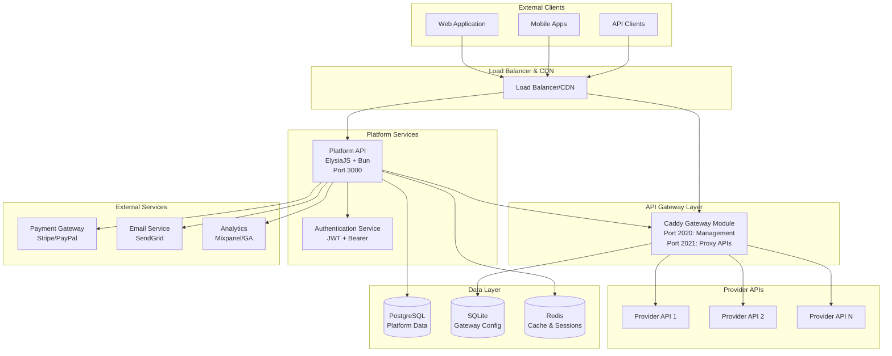
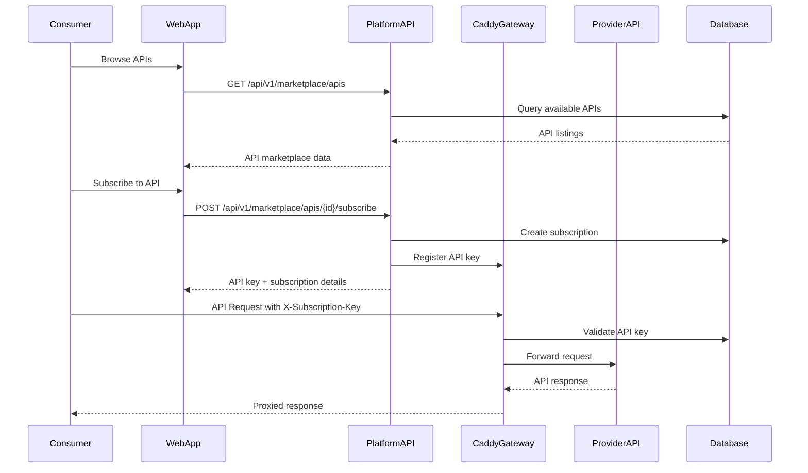
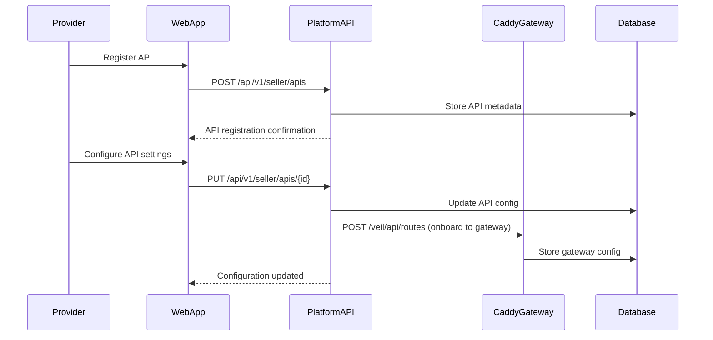
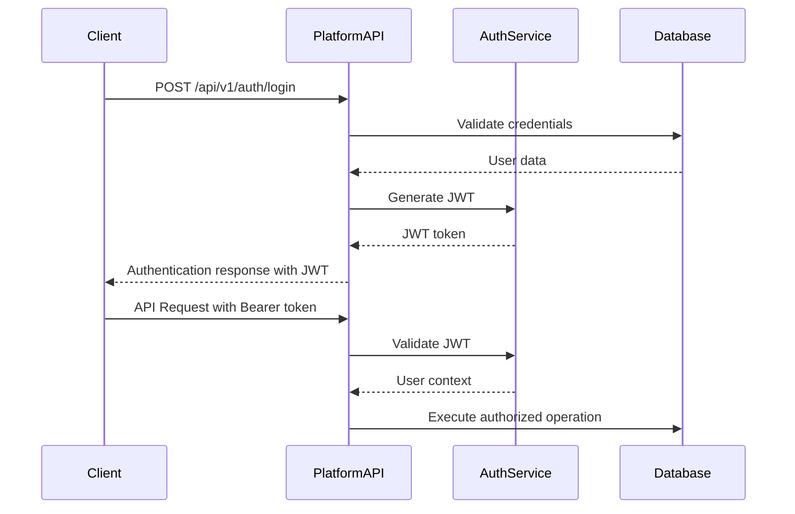

# High-Level Design: Veil API Selling Platform Backend

## 1. System Overview

Veil is a comprehensive API marketplace platform that enables API providers to easily sell their APIs and consumers to discover and subscribe to APIs. The system is built on a modular architecture with clear separation of concerns.

### Core Components

## 2. System Architecture Layers

### 2.1 API Gateway Layer (Caddy Module)

**Purpose**: Request routing, authentication, rate limiting, and API validation

**Key Responsibilities**:
- API request validation and routing
- Subscription-based access control
- Rate limiting per API key
- Request/response logging and metrics
- SSL termination and security

**Technology**: Custom Caddy module written in Go

**Ports**:
- `2020`: Management API for configuration
- `2021`: Proxied API endpoints for consumers

### 2.2 Platform Service Layer

**Purpose**: Business logic, user management, marketplace functionality

**Key Responsibilities**:
- User authentication and authorization
- API marketplace operations
- Subscription management
- Payment processing
- Analytics and reporting
- Admin operations

**Technology**: ElysiaJS with Bun runtime

### 2.3 Data Layer

**Components**:
- **PostgreSQL**: Primary database for platform data
- **SQLite**: Caddy configuration and gateway data
- **Redis**: Caching and session management

## 3. Data Flow Architecture

### 3.1 API Consumer Flow

### 3.2 API Provider Flow

## 4. Service Interactions

### 4.1 Platform API ↔ Caddy Gateway

The Platform API manages the Caddy Gateway through its management endpoints:

**API Onboarding**:
- Platform API calls `POST /veil/api/routes` to register new API routes
- Caddy dynamically updates routing configuration
- Routes are immediately available for consumers

**Key Management**:
- Platform API calls `POST /veil/api/keys` to add/update API keys
- Caddy validates keys in real-time during request processing
- Key status changes (activate/deactivate) are handled via `PUT /veil/api/keys/status`

### 4.2 Authentication Flow

## 5. Key Design Decisions

### 5.1 Dual Database Strategy
- **PostgreSQL**: Complex relational data, ACID compliance for financial transactions
- **SQLite**: High-performance gateway configuration, embedded with Caddy

### 5.2 Microservice Communication
- **Synchronous**: HTTP REST APIs for real-time operations
- **Event-driven**: For analytics and non-critical operations

### 5.3 Security Architecture
- **Authentication**: JWT with Bearer tokens
- **Authorization**: Role-based access control (RBAC)
- **API Security**: Subscription key validation at gateway level
- **Rate Limiting**: Implemented at gateway level per API key

### 5.4 Scalability Considerations
- **Horizontal Scaling**: Platform API can run multiple instances
- **Load Balancing**: Caddy handles load balancing to upstream services
- **Caching**: Redis for session management and frequently accessed data

## 6. Technology Stack

| Layer | Technology | Purpose |
|-------|------------|---------|
| API Gateway | Caddy (Go) | Request routing, validation, rate limiting |
| Platform API | ElysiaJS + Bun | Business logic, REST APIs |
| Database | PostgreSQL + SQLite | Data persistence |
| Cache | Redis | Session management, caching |
| Authentication | JWT | Stateless authentication |
| Runtime | Bun | High-performance JavaScript runtime |

## 7. Non-Functional Requirements

### 7.1 Performance
- **Response Time**: < 200ms for API gateway operations
- **Throughput**: Support 10,000+ concurrent API requests
- **Availability**: 99.9% uptime target

### 7.2 Security
- **Data Encryption**: TLS 1.3 for all communications
- **API Security**: Rate limiting, authentication, input validation
- **Compliance**: SOC2, GDPR compliance ready

### 7.3 Scalability
- **Auto-scaling**: Platform API scales based on demand
- **Database**: Read replicas for query scaling
- **CDN**: Global content distribution for static assets

## 8. Monitoring & Observability

### 8.1 Metrics Collection
- **Application Metrics**: Request rates, error rates, response times
- **Business Metrics**: API usage, subscription rates, revenue
- **Infrastructure Metrics**: CPU, memory, disk, network utilization

### 8.2 Logging Strategy
- **Structured Logging**: JSON format for all services
- **Centralized Logging**: ELK stack or similar
- **Audit Logging**: All administrative actions and financial transactions

### 8.3 Health Checks
- **Service Health**: HTTP health endpoints for all services
- **Database Health**: Connection pooling and query performance monitoring
- **External Dependencies**: Payment gateway, email service availability

## 9. Deployment Architecture

### 9.1 Container Strategy
- **Docker**: All services containerized
- **Orchestration**: Kubernetes for production deployment
- **CI/CD**: Automated testing and deployment pipelines

### 9.2 Environment Strategy
- **Development**: Local Docker Compose setup
- **Staging**: Kubernetes cluster mimicking production
- **Production**: Multi-region Kubernetes deployment

This architecture provides a robust, scalable foundation for the Veil API marketplace platform, enabling easy API onboarding, secure access management, and comprehensive business operations.