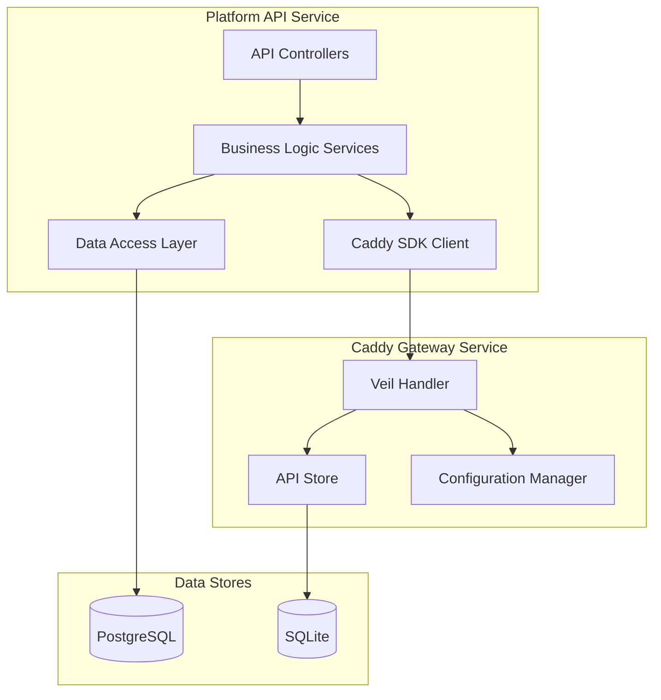
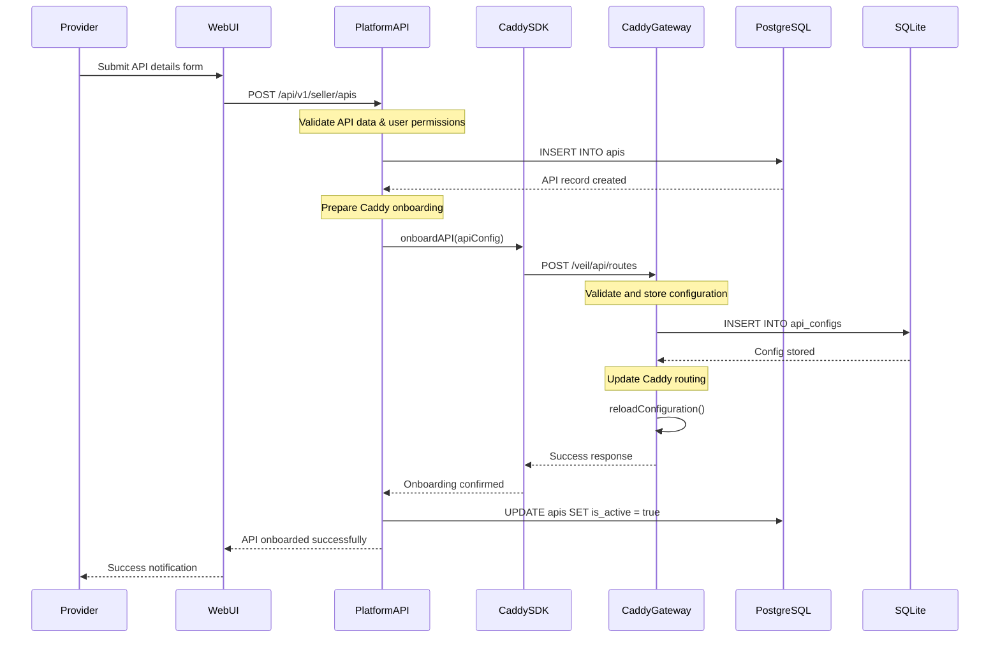
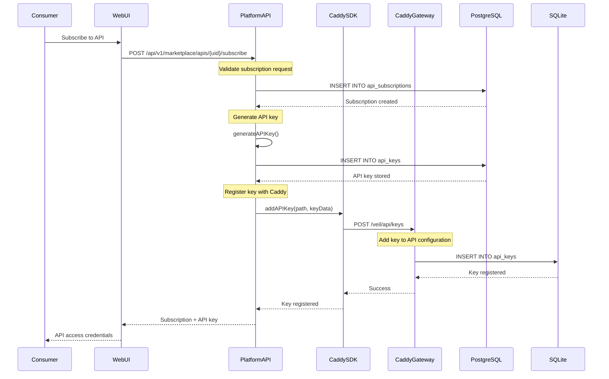
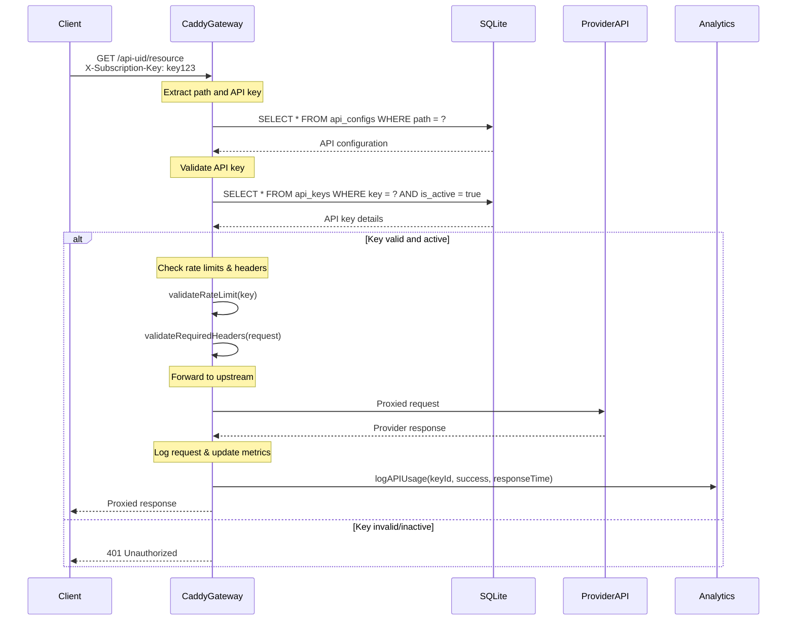

# Low-Level Design: API Management Flows

## 1. Overview

This document details the low-level implementation of API management flows in the Veil platform, focusing on the interaction between the Platform API and Caddy Gateway for onboarding APIs, managing subscriptions, and handling API keys.

## 2. Core API Management Components

### 2.1 Service Architecture



### 2.2 Data Models

#### Platform API Models (PostgreSQL)

```typescript
// User model
interface User {
  id: number;
  uid: string;
  email: string;
  firstName: string;
  lastName: string;
  role: 'buyer' | 'seller' | 'admin';
  isActive: boolean;
  createdAt: Date;
}

// API model
interface API {
  id: number;
  uid: string;
  sellerId: number;
  categoryId?: number;
  name: string;
  description: string;
  version: string;
  endpoint: string;
  baseUrl: string;
  pricingModel: 'per_request' | 'monthly' | 'yearly';
  requestLimit: number;
  isActive: boolean;
  isPublic: boolean;
  createdAt: Date;
}

// Subscription model
interface Subscription {
  id: number;
  uid: string;
  userId: number;
  apiId: number;
  status: 'active' | 'suspended' | 'cancelled';
  requestsLimit: number;
  requestsUsed: number;
  createdAt: Date;
}

// API Key model
interface APIKey {
  id: number;
  uid: string;
  subscriptionId: number;
  keyValue: string;
  name: string;
  isActive: boolean;
  expiresAt?: Date;
  createdAt: Date;
}
```

#### Caddy Gateway Models (SQLite)

```go
// API configuration in Caddy
type APIConfig struct {
    ID                   uint      `gorm:"primaryKey"`
    Path                string    `gorm:"uniqueIndex;not null"`
    Upstream            string    `gorm:"not null"`
    RequiredSubscription string    `gorm:"not null"`
    Methods             []Method  `gorm:"foreignKey:APIConfigID"`
    RequiredHeaders     []string  `gorm:"type:json"`
    Parameters          []Parameter `gorm:"type:json"`
    APIKeys             []APIKey  `gorm:"foreignKey:APIConfigID"`
    RequestCount        uint64    `gorm:"default:0"`
    LastAccessed        *time.Time
    CreatedAt           time.Time
    UpdatedAt           time.Time
}

// API Key in Caddy
type APIKey struct {
    ID           uint   `gorm:"primaryKey"`
    APIConfigID  uint   `gorm:"not null"`
    Key          string `gorm:"uniqueIndex;not null"`
    Name         string `gorm:"not null"`
    IsActive     bool   `gorm:"default:true"`
    ExpiresAt    *time.Time
    CreatedAt    time.Time
    UpdatedAt    time.Time
}
```

## 3. Detailed Flow Implementations

### 3.1 API Provider Onboarding Flow

#### Sequence Diagram



#### Implementation Details

##### Platform API Service Layer

```typescript
// API Onboarding Service
export class APIOnboardingService {
  constructor(
    private apiRepository: APIRepository,
    private caddyClient: CaddySDKClient
  ) {}

  async onboardAPI(sellerId: number, apiData: CreateAPIRequest): Promise<API> {
    // 1. Validate API data
    await this.validateAPIData(apiData);
    
    // 2. Check seller permissions
    await this.validateSellerPermissions(sellerId);
    
    // 3. Create API record in PostgreSQL
    const api = await this.apiRepository.create({
      sellerId,
      ...apiData,
      isActive: false // Initially inactive until Caddy confirms
    });

    try {
      // 4. Prepare Caddy configuration
      const caddyConfig = this.prepareCaddyConfig(api, apiData);
      
      // 5. Onboard to Caddy Gateway
      await this.caddyClient.onboardAPI(caddyConfig);
      
      // 6. Activate API
      await this.apiRepository.update(api.id, { isActive: true });
      
      return api;
    } catch (error) {
      // Rollback on failure
      await this.apiRepository.delete(api.id);
      throw new APIOnboardingError('Failed to onboard API to gateway', error);
    }
  }

  private prepareCaddyConfig(api: API, apiData: CreateAPIRequest): CaddyAPIConfig {
    return {
      path: `/${api.uid}/*`,
      upstream: apiData.baseUrl + apiData.endpoint,
      required_subscription: api.uid,
      methods: apiData.methods || ['GET'],
      required_headers: apiData.requiredHeaders || [],
      api_keys: [] // Keys will be added when users subscribe
    };
  }
}
```

##### Caddy Gateway Handler

```go
// Veil Handler - API Onboarding
func (v *VeilHandler) handleAPIOnboarding(w http.ResponseWriter, r *http.Request) error {
    var req APIOnboardRequest
    if err := json.NewDecoder(r.Body).Decode(&req); err != nil {
        return writeError(w, http.StatusBadRequest, "Invalid request body")
    }

    // Validate request
    if err := v.validateOnboardingRequest(&req); err != nil {
        return writeError(w, http.StatusBadRequest, err.Error())
    }

    // Check if API path already exists
    existing, err := v.store.GetAPIByPath(req.Path)
    if err == nil && existing != nil {
        return writeError(w, http.StatusConflict, "API path already exists")
    }

    // Create API configuration
    apiConfig := &APIConfig{
        Path:                req.Path,
        Upstream:           req.Upstream,
        RequiredSubscription: req.RequiredSubscription,
        RequiredHeaders:    req.RequiredHeaders,
        Methods:            convertMethods(req.Methods),
        Parameters:         req.Parameters,
    }

    // Store in SQLite
    if err := v.store.StoreAPI(apiConfig); err != nil {
        v.logger.Error("Failed to store API config", zap.Error(err))
        return writeError(w, http.StatusInternalServerError, "Failed to store API configuration")
    }

    // Reload Caddy configuration
    if err := v.reloadCaddyConfig(); err != nil {
        v.logger.Error("Failed to reload Caddy config", zap.Error(err))
        // Note: API is stored but routing not active - manual intervention needed
    }

    response := APIResponse{
        Status:  "success",
        Message: "API onboarded successfully",
        API:     apiConfig,
    }

    return writeJSON(w, http.StatusCreated, response)
}
```

### 3.2 Subscription & API Key Management Flow

#### Sequence Diagram



#### Implementation Details

##### Subscription Service

```typescript
export class SubscriptionService {
  constructor(
    private subscriptionRepository: SubscriptionRepository,
    private apiKeyRepository: APIKeyRepository,
    private caddyClient: CaddySDKClient,
    private keyGenerator: APIKeyGenerator
  ) {}

  async createSubscription(
    userId: number, 
    apiUid: string, 
    subscriptionData: CreateSubscriptionRequest
  ): Promise<SubscriptionWithKey> {
    const api = await this.apiRepository.findByUid(apiUid);
    if (!api || !api.isActive) {
      throw new NotFoundError('API not found or inactive');
    }

    // Create subscription
    const subscription = await this.subscriptionRepository.create({
      userId,
      apiId: api.id,
      requestsLimit: subscriptionData.requestsLimit || api.requestLimit,
      status: 'active'
    });

    // Generate API key
    const keyValue = this.keyGenerator.generate();
    const apiKey = await this.apiKeyRepository.create({
      subscriptionId: subscription.id,
      keyValue,
      name: subscriptionData.keyName || `${api.name} Key`,
      isActive: true,
      expiresAt: subscriptionData.expiresAt
    });

    try {
      // Register key with Caddy
      await this.caddyClient.addAPIKey({
        path: `/${api.uid}/*`,
        api_keys: [{
          key: keyValue,
          name: apiKey.name,
          is_active: true
        }]
      });

      return {
        subscription,
        apiKey: {
          ...apiKey,
          keyValue // Only return key value during creation
        }
      };
    } catch (error) {
      // Rollback on failure
      await this.subscriptionRepository.delete(subscription.id);
      await this.apiKeyRepository.delete(apiKey.id);
      throw new SubscriptionError('Failed to register API key', error);
    }
  }

  async regenerateAPIKey(keyUid: string, userId: number): Promise<APIKey> {
    const existingKey = await this.apiKeyRepository.findByUid(keyUid);
    if (!existingKey) {
      throw new NotFoundError('API key not found');
    }

    const subscription = await this.subscriptionRepository.findById(existingKey.subscriptionId);
    if (subscription.userId !== userId) {
      throw new ForbiddenError('Not authorized to regenerate this key');
    }

    const api = await this.apiRepository.findById(subscription.apiId);
    const newKeyValue = this.keyGenerator.generate();

    // Update key in database
    await this.apiKeyRepository.update(existingKey.id, {
      keyValue: newKeyValue,
      updatedAt: new Date()
    });

    // Update key in Caddy
    try {
      // Remove old key
      await this.caddyClient.deleteAPIKey({
        path: `/${api.uid}/*`,
        api_key: existingKey.keyValue
      });

      // Add new key
      await this.caddyClient.addAPIKey({
        path: `/${api.uid}/*`,
        api_keys: [{
          key: newKeyValue,
          name: existingKey.name,
          is_active: true
        }]
      });

      return {
        ...existingKey,
        keyValue: newKeyValue
      };
    } catch (error) {
      // Rollback database change
      await this.apiKeyRepository.update(existingKey.id, {
        keyValue: existingKey.keyValue
      });
      throw new APIKeyError('Failed to regenerate API key', error);
    }
  }
}
```

##### Caddy Key Management Handler

```go
// Add API Key Handler
func (v *VeilHandler) handleAddAPIKey(w http.ResponseWriter, r *http.Request) error {
    var req APIKeysRequest
    if err := json.NewDecoder(r.Body).Decode(&req); err != nil {
        return writeError(w, http.StatusBadRequest, "Invalid request body")
    }

    // Validate request
    if req.Path == "" || len(req.APIKeys) == 0 {
        return writeError(w, http.StatusBadRequest, "Path and at least one API key are required")
    }

    // Find existing API configuration
    apiConfig, err := v.store.GetAPIByPath(req.Path)
    if err != nil || apiConfig == nil {
        return writeError(w, http.StatusNotFound, "API not found")
    }

    // Add keys to configuration
    for _, keyReq := range req.APIKeys {
        // Check if key already exists
        existing, _ := v.store.GetAPIKeyByValue(keyReq.Key)
        if existing != nil {
            return writeError(w, http.StatusConflict, fmt.Sprintf("API key '%s' already exists", keyReq.Key))
        }

        // Create new key
        apiKey := &APIKey{
            APIConfigID: apiConfig.ID,
            Key:         keyReq.Key,
            Name:        keyReq.Name,
            IsActive:    keyReq.IsActive,
            ExpiresAt:   parseExpiryDate(keyReq.ExpiresAt),
        }

        if err := v.store.StoreAPIKey(apiKey); err != nil {
            v.logger.Error("Failed to store API key", zap.Error(err))
            return writeError(w, http.StatusInternalServerError, "Failed to store API key")
        }

        apiConfig.APIKeys = append(apiConfig.APIKeys, *apiKey)
    }

    response := APIResponse{
        Status:  "success",
        Message: "API keys added successfully",
        API:     apiConfig,
    }

    return writeJSON(w, http.StatusCreated, response)
}
```

### 3.3 API Request Validation Flow

#### Runtime Request Processing



#### Validation Implementation

```go
// Request validation middleware
func (v *VeilHandler) ServeHTTP(w http.ResponseWriter, r *http.Request) error {
    // Extract API path
    apiPath := v.extractAPIPath(r.URL.Path)
    
    // Get API configuration
    apiConfig, err := v.store.GetAPIByPath(apiPath)
    if err != nil || apiConfig == nil {
        return writeError(w, http.StatusNotFound, "API not found")
    }

    // Extract and validate API key
    apiKey := r.Header.Get("X-Subscription-Key")
    if apiKey == "" {
        return writeError(w, http.StatusUnauthorized, "API key required")
    }

    keyConfig, err := v.store.GetAPIKeyByValue(apiKey)
    if err != nil || keyConfig == nil || !keyConfig.IsActive {
        return writeError(w, http.StatusUnauthorized, "Invalid or inactive API key")
    }

    // Check expiration
    if keyConfig.ExpiresAt != nil && time.Now().After(*keyConfig.ExpiresAt) {
        return writeError(w, http.StatusUnauthorized, "API key expired")
    }

    // Validate HTTP method
    if !v.isMethodAllowed(r.Method, apiConfig.Methods) {
        return writeError(w, http.StatusMethodNotAllowed, "Method not allowed")
    }

    // Validate required headers
    if err := v.validateRequiredHeaders(r, apiConfig.RequiredHeaders); err != nil {
        return writeError(w, http.StatusBadRequest, err.Error())
    }

    // Rate limiting
    if err := v.checkRateLimit(keyConfig.Key); err != nil {
        return writeError(w, http.StatusTooManyRequests, "Rate limit exceeded")
    }

    // Forward to upstream
    startTime := time.Now()
    err = v.proxyToUpstream(w, r, apiConfig.Upstream)
    responseTime := time.Since(startTime)

    // Log usage analytics
    v.logAPIUsage(keyConfig.ID, apiConfig.ID, err == nil, responseTime)

    return err
}
```

## 4. Error Handling & Recovery

### 4.1 Transaction Management

#### Platform API Transactions

```typescript
// Service layer with transaction management
export class APIManagementService {
  async onboardAPIWithTransaction(sellerId: number, apiData: CreateAPIRequest): Promise<API> {
    return this.db.transaction(async (trx) => {
      // Create API record
      const api = await this.apiRepository.create(apiData, trx);
      
      try {
        // Onboard to Caddy
        await this.caddyClient.onboardAPI(this.prepareCaddyConfig(api));
        
        // Commit by returning successfully
        return api;
      } catch (error) {
        // Transaction will automatically rollback
        throw new APIOnboardingError('Caddy onboarding failed', error);
      }
    });
  }
}
```

### 4.2 Retry Mechanisms

```typescript
// Caddy client with retry logic
export class CaddySDKClient {
  private async executeWithRetry<T>(
    operation: () => Promise<T>,
    maxRetries: number = 3
  ): Promise<T> {
    let lastError: Error;
    
    for (let attempt = 1; attempt <= maxRetries; attempt++) {
      try {
        return await operation();
      } catch (error) {
        lastError = error;
        
        if (attempt < maxRetries && this.isRetryableError(error)) {
          const delay = Math.pow(2, attempt) * 1000; // Exponential backoff
          await this.sleep(delay);
          continue;
        }
        
        throw error;
      }
    }
    
    throw lastError;
  }

  async onboardAPI(config: CaddyAPIConfig): Promise<void> {
    return this.executeWithRetry(async () => {
      const response = await fetch(`${this.baseUrl}/veil/api/routes`, {
        method: 'POST',
        headers: { 'Content-Type': 'application/json' },
        body: JSON.stringify(config)
      });
      
      if (!response.ok) {
        throw new CaddyAPIError(`Onboarding failed: ${response.status}`);
      }
    });
  }
}
```

## 5. Performance Optimizations

### 5.1 Caching Strategy

```typescript
// Redis caching for frequently accessed data
export class CachedAPIService {
  constructor(
    private apiService: APIService,
    private redis: RedisClient
  ) {}

  async getAPI(uid: string): Promise<API> {
    const cacheKey = `api:${uid}`;
    
    // Try cache first
    const cached = await this.redis.get(cacheKey);
    if (cached) {
      return JSON.parse(cached);
    }
    
    // Fallback to database
    const api = await this.apiService.getByUid(uid);
    
    // Cache for 1 hour
    await this.redis.setex(cacheKey, 3600, JSON.stringify(api));
    
    return api;
  }
}
```

### 5.2 Database Connection Pooling

```go
// Optimized SQLite configuration for Caddy
func (s *APIStore) initDatabase() error {
    db, err := gorm.Open(sqlite.Open(s.dbPath), &gorm.Config{
        Logger: logger.Default.LogMode(logger.Silent),
    })
    if err != nil {
        return err
    }

    sqlDB, err := db.DB()
    if err != nil {
        return err
    }

    // Connection pool settings
    sqlDB.SetMaxOpenConns(25)
    sqlDB.SetMaxIdleConns(10)
    sqlDB.SetConnMaxLifetime(5 * time.Minute)

    // SQLite optimizations
    db.Exec("PRAGMA journal_mode = WAL")
    db.Exec("PRAGMA synchronous = NORMAL")
    db.Exec("PRAGMA cache_size = 1000")
    db.Exec("PRAGMA foreign_keys = ON")

    s.db = db
    return nil
}
```

This Low-Level Design provides detailed implementation guidance for the core API management flows, ensuring robust error handling, performance optimization, and maintainable code architecture.