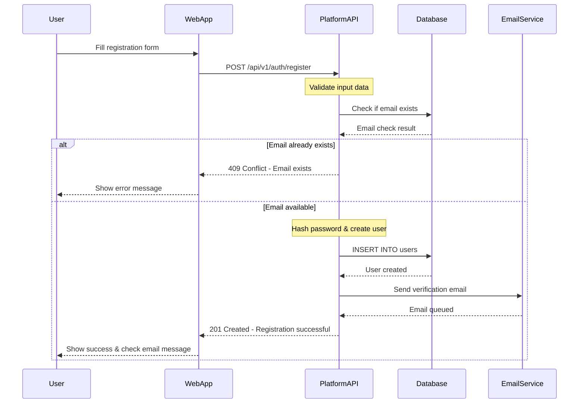
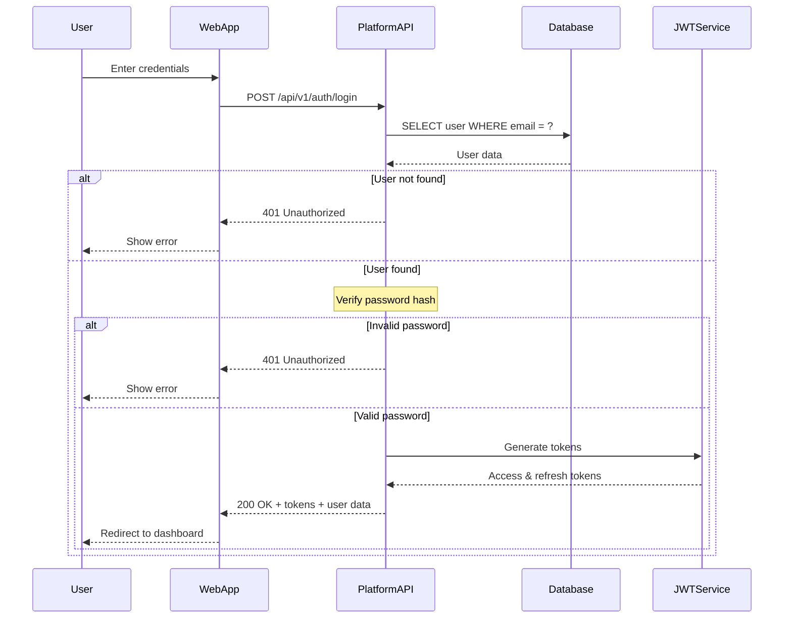
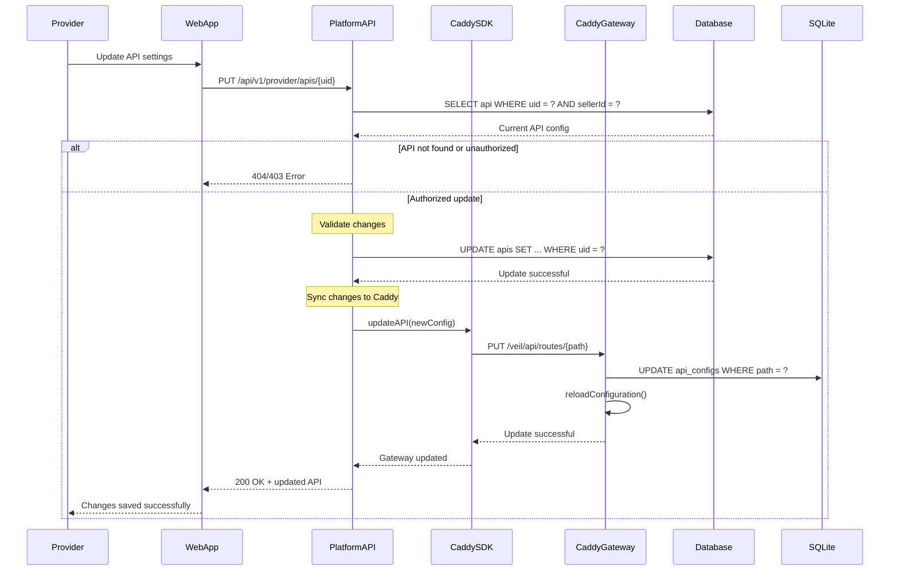
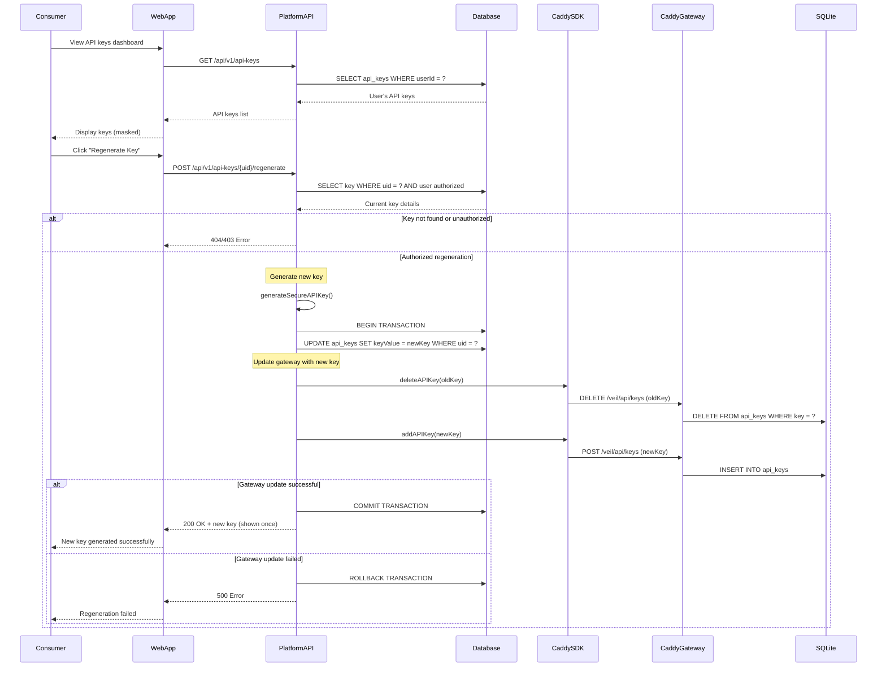
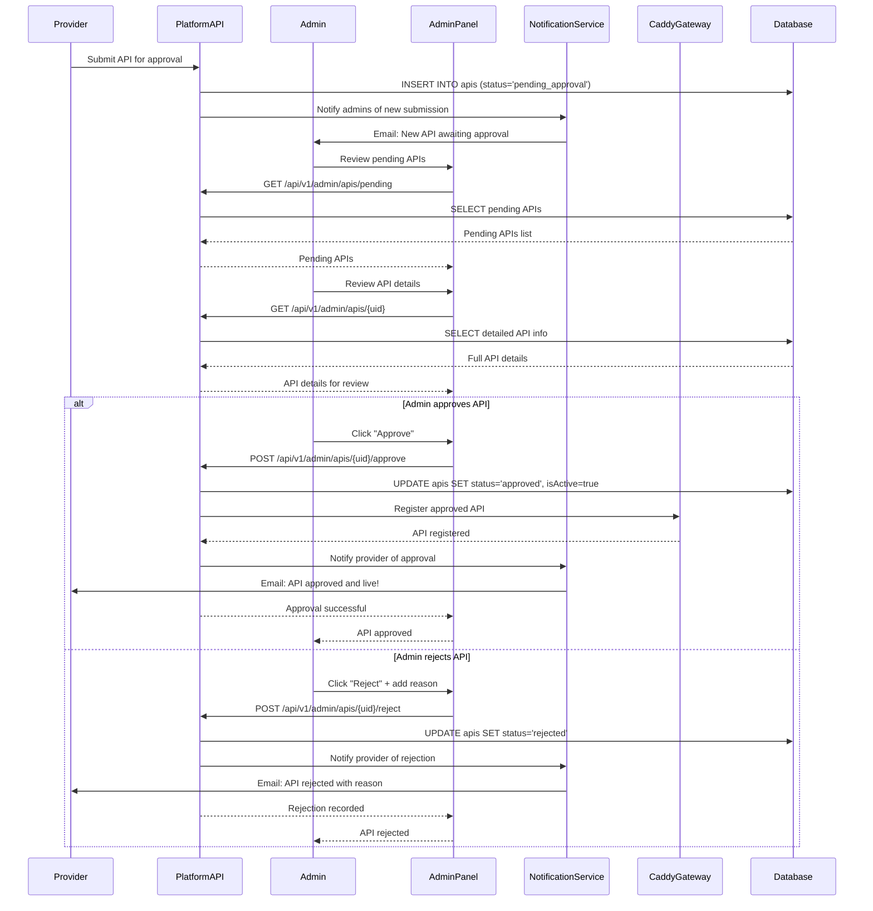

# System Flow Diagrams

This document contains detailed flow diagrams for all major processes in the Veil API marketplace platform.

## 1. User Registration & Authentication Flow

### 1.1 User Registration Process



### 1.2 User Login Process



## 2. API Provider Onboarding Flow

### 2.1 Complete API Onboarding Process

```mermaid
sequenceDiagram
    participant Provider
    participant WebApp
    participant PlatformAPI
    participant CaddySDK
    participant CaddyGateway
    participant PostgreSQL
    participant SQLite
    participant NotificationService

    Provider->>WebApp: Fill API registration form
    WebApp->>PlatformAPI: POST /api/v1/provider/apis
    
    note over PlatformAPI: Validate API data & permissions
    PlatformAPI->>PostgreSQL: BEGIN TRANSACTION
    
    PlatformAPI->>PostgreSQL: INSERT INTO apis (isActive=false)
    PostgreSQL-->>PlatformAPI: API record created (ID: 123)
    
    note over PlatformAPI: Prepare Caddy configuration
    PlatformAPI->>CaddySDK: onboardAPI({
        path: "/api-uuid/*",
        upstream: "provider.com/api",
        methods: ["GET", "POST"]
    })
    
    CaddySDK->>CaddyGateway: POST /veil/api/routes
    
    note over CaddyGateway: Validate configuration
    alt Invalid configuration
        CaddyGateway-->>CaddySDK: 400 Bad Request
        CaddySDK-->>PlatformAPI: Onboarding failed
        
        PlatformAPI->>PostgreSQL: ROLLBACK TRANSACTION
        PlatformAPI-->>WebApp: 400 Error
        WebApp-->>Provider: Configuration error
    else Valid configuration
        CaddyGateway->>SQLite: INSERT INTO api_configs
        SQLite-->>CaddyGateway: Config stored
        
        note over CaddyGateway: Update Caddy routing dynamically
        CaddyGateway->>CaddyGateway: reloadConfiguration()
        CaddyGateway-->>CaddySDK: 201 Created
        CaddySDK-->>PlatformAPI: Onboarding successful
        
        PlatformAPI->>PostgreSQL: UPDATE apis SET isActive=true WHERE id=123
        PlatformAPI->>PostgreSQL: COMMIT TRANSACTION
        
        PlatformAPI->>NotificationService: Send confirmation email
        PlatformAPI-->>WebApp: 201 Created + API details
        WebApp-->>Provider: Success! API is live
    end
```

### 2.2 API Configuration Update Flow



## 3. Consumer Subscription Flow

### 3.1 API Discovery & Subscription

```mermaid
sequenceDiagram
    participant Consumer
    participant WebApp
    participant PlatformAPI
    participant Database
    participant CaddySDK
    participant CaddyGateway
    participant PaymentService
    participant NotificationService

    Consumer->>WebApp: Browse API marketplace
    WebApp->>PlatformAPI: GET /api/v1/marketplace/apis
    PlatformAPI->>Database: SELECT active public APIs with ratings
    Database-->>PlatformAPI: API listings
    PlatformAPI-->>WebApp: Marketplace data
    WebApp-->>Consumer: Display APIs

    Consumer->>WebApp: Select API & view details
    WebApp->>PlatformAPI: GET /api/v1/marketplace/apis/{uid}
    PlatformAPI->>Database: SELECT detailed API info
    Database-->>PlatformAPI: API details + reviews
    PlatformAPI-->>WebApp: Detailed API info
    WebApp-->>Consumer: Show API details

    Consumer->>WebApp: Click "Subscribe"
    WebApp->>PlatformAPI: POST /api/v1/marketplace/apis/{uid}/subscribe
    
    note over PlatformAPI: Validate subscription request
    PlatformAPI->>Database: Check existing subscription
    Database-->>PlatformAPI: Subscription check result
    
    alt Already subscribed
        PlatformAPI-->>WebApp: 409 Conflict
        WebApp-->>Consumer: Already subscribed message
    else New subscription
        note over PlatformAPI: Process payment if required
        alt Paid API
            PlatformAPI->>PaymentService: Process payment
            PaymentService-->>PlatformAPI: Payment successful
        end
        
        PlatformAPI->>Database: BEGIN TRANSACTION
        
        note over PlatformAPI: Create subscription
        PlatformAPI->>Database: INSERT INTO api_subscriptions
        Database-->>PlatformAPI: Subscription created (ID: 456)
        
        note over PlatformAPI: Generate API key
        PlatformAPI->>PlatformAPI: generateSecureAPIKey()
        PlatformAPI->>Database: INSERT INTO api_keys
        Database-->>PlatformAPI: API key stored
        
        note over PlatformAPI: Register key with gateway
        PlatformAPI->>CaddySDK: addAPIKey({
            path: "/api-uuid/*",
            key: "generated-key",
            active: true
        })
        
        CaddySDK->>CaddyGateway: POST /veil/api/keys
        CaddyGateway->>SQLite: INSERT INTO api_keys
        CaddyGateway-->>CaddySDK: Key registered
        CaddySDK-->>PlatformAPI: Gateway registration complete
        
        PlatformAPI->>Database: COMMIT TRANSACTION
        
        PlatformAPI->>NotificationService: Send welcome email with API key
        PlatformAPI-->>WebApp: 201 Created + subscription + API key
        WebApp-->>Consumer: Success! Here's your API key
    end
```

### 3.2 API Key Management Flow



## 4. API Request Processing Flow

### 4.1 Consumer API Request Validation & Proxying

```mermaid
sequenceDiagram
    participant Consumer
    participant CaddyGateway
    participant SQLite
    participant ProviderAPI
    participant AnalyticsService
    participant RateLimiter

    Consumer->>CaddyGateway: GET /weather-api/current?city=London
        note right of Consumer: Headers:
        note right of Consumer: X-Subscription-Key: veil_sk_abc123
        note right of Consumer: Content-Type: application/json

    note over CaddyGateway: Extract API path and key
    CaddyGateway->>CaddyGateway: parsePath("/weather-api/current") → "/weather-api/*"
    CaddyGateway->>CaddyGateway: extractKey("X-Subscription-Key")

    CaddyGateway->>SQLite: SELECT * FROM api_configs WHERE path = "/weather-api/*"
    SQLite-->>CaddyGateway: API configuration found

    alt API not found
        CaddyGateway-->>Consumer: 404 Not Found
    else API found
        CaddyGateway->>SQLite: SELECT * FROM api_keys WHERE key = "veil_sk_abc123"
        SQLite-->>CaddyGateway: API key details

        alt Invalid/inactive key
            CaddyGateway-->>Consumer: 401 Unauthorized - Invalid API key
        else Valid key
            note over CaddyGateway: Validate request
            CaddyGateway->>CaddyGateway: validateMethod("GET", allowedMethods)
            CaddyGateway->>CaddyGateway: validateHeaders(requiredHeaders)
            
            alt Validation failed
                CaddyGateway-->>Consumer: 400 Bad Request
            else Validation passed
                CaddyGateway->>RateLimiter: checkRateLimit(keyId)
                RateLimiter-->>CaddyGateway: Rate limit status
                
                alt Rate limit exceeded
                    CaddyGateway-->>Consumer: 429 Too Many Requests
                else Within rate limit
                    note over CaddyGateway: Forward to upstream
                    CaddyGateway->>ProviderAPI: GET /current?city=London
                        note right of CaddyGateway: Headers: Original + Provider-specific
                    
                    ProviderAPI-->>CaddyGateway: 200 OK + Weather data
                    
                    note over CaddyGateway: Log request & update metrics
                    CaddyGateway->>AnalyticsService: logAPIUsage({
                        keyId: "key123",
                        success: true,
                        responseTime: 150,
                        timestamp: now
                    })
                    
                    CaddyGateway->>SQLite: UPDATE api_keys SET lastUsed = now
                    CaddyGateway-->>Consumer: 200 OK + Weather data
                end
            end
        end
    end
```

### 4.2 Error Handling & Retry Flow

```mermaid
sequenceDiagram
    participant Consumer
    participant CaddyGateway
    participant ProviderAPI
    participant AnalyticsService
    participant AlertingService

    Consumer->>CaddyGateway: API Request
    CaddyGateway->>ProviderAPI: Forward request
    
    alt Provider API timeout
        ProviderAPI-->>CaddyGateway: Timeout (no response)
        
        note over CaddyGateway: Implement retry logic
        CaddyGateway->>ProviderAPI: Retry #1
        ProviderAPI-->>CaddyGateway: Timeout again
        
        CaddyGateway->>ProviderAPI: Retry #2
        ProviderAPI-->>CaddyGateway: Timeout again
        
        note over CaddyGateway: Max retries exceeded
        CaddyGateway->>AnalyticsService: logFailedRequest({
            error: "upstream_timeout",
            retries: 2
        })
        
        CaddyGateway->>AlertingService: notifyProviderAPIDown(apiId)
        CaddyGateway-->>Consumer: 504 Gateway Timeout
    
    else Provider API error
        ProviderAPI-->>CaddyGateway: 500 Internal Server Error
        
        CaddyGateway->>AnalyticsService: logFailedRequest({
            error: "upstream_error",
            statusCode: 500
        })
        
        CaddyGateway-->>Consumer: 502 Bad Gateway
    
    else Provider API success
        ProviderAPI-->>CaddyGateway: 200 OK + Response
        
        CaddyGateway->>AnalyticsService: logSuccessfulRequest({
            responseTime: 120
        })
        
        CaddyGateway-->>Consumer: 200 OK + Response
    end
```

## 5. Payment & Billing Flow

### 5.1 Subscription Payment Processing

```mermaid
sequenceDiagram
    participant Consumer
    participant WebApp
    participant PlatformAPI
    participant PaymentService
    participant Database
    participant BillingService
    participant NotificationService

    Consumer->>WebApp: Subscribe to paid API
    WebApp->>PlatformAPI: POST /api/v1/marketplace/apis/{uid}/subscribe
    
    PlatformAPI->>Database: SELECT api pricing info
    Database-->>PlatformAPI: API pricing details
    
    alt Free API
        note over PlatformAPI: Skip payment, create subscription directly
    else Paid API
        note over PlatformAPI: Process payment first
        PlatformAPI->>PaymentService: createPaymentIntent({
            amount: apiPrice,
            currency: "USD",
            customer: userId,
            metadata: { apiUid, subscriptionType }
        })
        
        PaymentService-->>PlatformAPI: Payment intent created
        PlatformAPI-->>WebApp: Payment intent details
        
        WebApp-->>Consumer: Show payment form
        Consumer->>WebApp: Enter payment details
        WebApp->>PaymentService: Confirm payment
        
        PaymentService-->>WebApp: Payment successful
        WebApp->>PlatformAPI: POST /api/v1/payments/confirm
        
        PlatformAPI->>PaymentService: Verify payment
        PaymentService-->>PlatformAPI: Payment confirmed
        
        note over PlatformAPI: Create subscription after payment
        PlatformAPI->>Database: BEGIN TRANSACTION
        
        PlatformAPI->>Database: INSERT INTO api_subscriptions
        PlatformAPI->>Database: INSERT INTO api_keys
        PlatformAPI->>Database: INSERT INTO payments
        
        PlatformAPI->>Database: COMMIT TRANSACTION
        
        note over PlatformAPI: Setup recurring billing if applicable
        alt Monthly/Yearly subscription
            PlatformAPI->>BillingService: setupRecurringBilling({
                customer: userId,
                amount: apiPrice,
                interval: pricingModel
            })
        end
        
        PlatformAPI->>NotificationService: Send receipt & API key
        PlatformAPI-->>WebApp: Subscription successful + API key
        WebApp-->>Consumer: Welcome! Here's your API access
    end
```

## 6. Analytics & Reporting Flow

### 6.1 Real-time Analytics Collection

```mermaid
sequenceDiagram
    participant CaddyGateway
    participant AnalyticsQueue
    participant AnalyticsProcessor
    participant Database
    participant CacheLayer
    participant Dashboard

    note over CaddyGateway: Each API request generates metrics
    CaddyGateway->>AnalyticsQueue: publishMetric({
        apiId: "123",
        keyId: "456",
        method: "GET",
        path: "/weather",
        statusCode: 200,
        responseTime: 150,
        timestamp: "2024-01-15T10:30:00Z"
    })

    AnalyticsQueue->>AnalyticsProcessor: Process metrics batch
    
    note over AnalyticsProcessor: Aggregate and process metrics
    AnalyticsProcessor->>AnalyticsProcessor: aggregateMetrics({
        byAPI: true,
        byTime: "hourly",
        byConsumer: true
    })
    
    AnalyticsProcessor->>Database: INSERT INTO api_usage_analytics
    AnalyticsProcessor->>CacheLayer: UPDATE real-time counters
    
    note over Dashboard: Provider checks analytics
    Dashboard->>PlatformAPI: GET /api/v1/provider/apis/{uid}/analytics
    
    PlatformAPI->>CacheLayer: GET real-time metrics
    CacheLayer-->>PlatformAPI: Current metrics
    
    PlatformAPI->>Database: SELECT historical analytics
    Database-->>PlatformAPI: Historical data
    
    PlatformAPI-->>Dashboard: Combined analytics response
```

### 6.2 Billing Analytics & Revenue Reporting

```mermaid
sequenceDiagram
    participant BillingService
    participant Database
    participant AnalyticsProcessor
    participant ReportingService
    participant Provider
    participant Admin

    note over BillingService: Monthly billing cycle
    BillingService->>Database: SELECT usage data for billing period
    Database-->>BillingService: Usage metrics per subscription
    
    BillingService->>BillingService: calculateBilling({
        usageMetrics,
        pricingModel,
        rateCard
    })
    
    BillingService->>Database: INSERT INTO billing_records
    BillingService->>AnalyticsProcessor: Update revenue metrics
    
    AnalyticsProcessor->>Database: UPDATE revenue analytics
    
    note over Provider: Provider views earnings
    Provider->>ReportingService: GET /api/v1/provider/analytics/revenue
    ReportingService->>Database: SELECT revenue analytics
    Database-->>ReportingService: Revenue data
    ReportingService-->>Provider: Revenue dashboard
    
    note over Admin: Admin views platform metrics
    Admin->>ReportingService: GET /api/v1/admin/analytics/platform
    ReportingService->>Database: SELECT platform-wide metrics
    Database-->>ReportingService: Platform analytics
    ReportingService-->>Admin: Platform dashboard
```

## 7. Admin Management Flow

### 7.1 API Approval Process



These flow diagrams provide a comprehensive view of all major processes in the Veil platform, showing the interaction between different components and the step-by-step execution of each workflow.