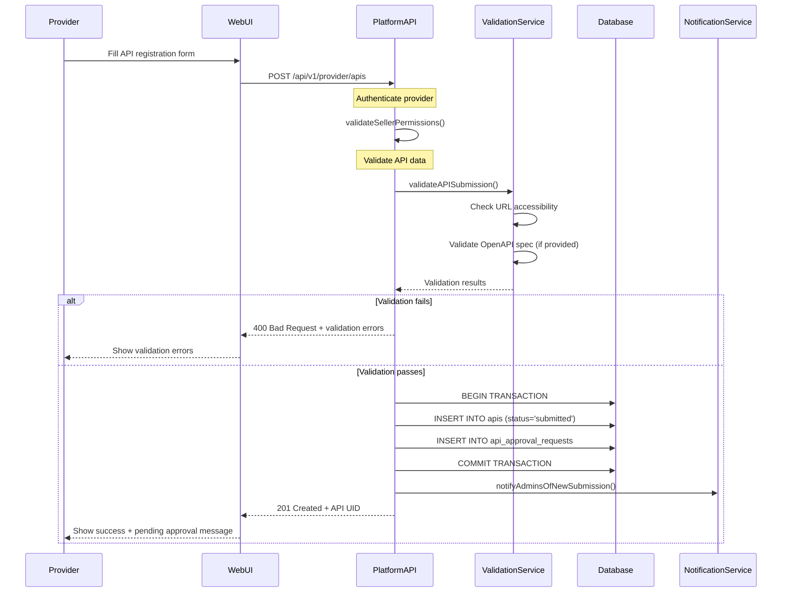
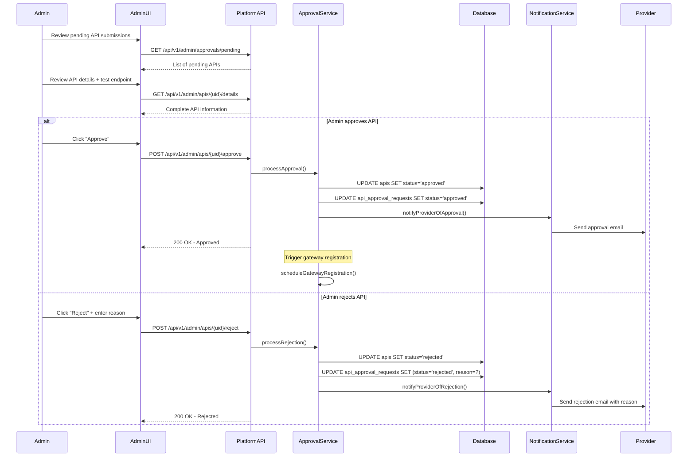
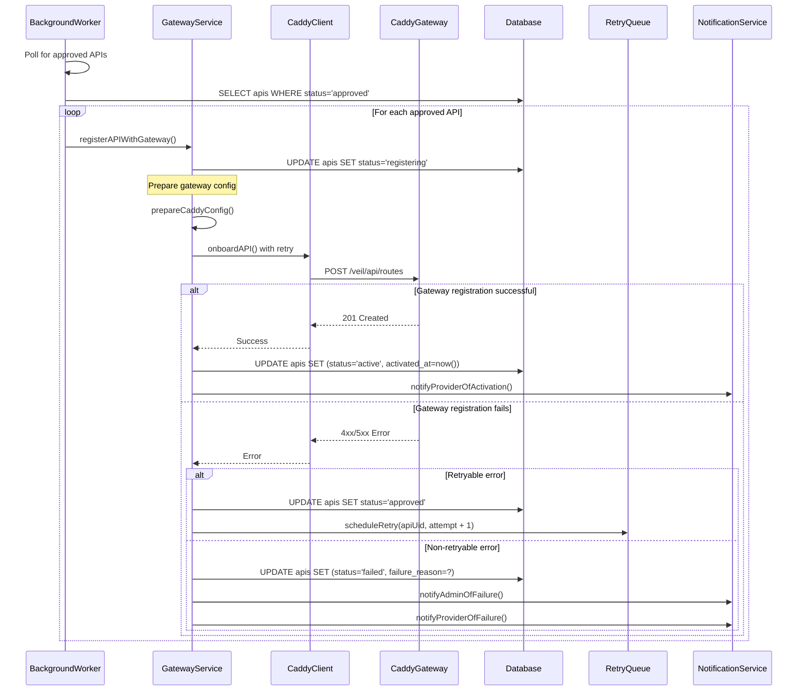

# Complete API Registration Flow Documentation

## Overview

This document details the complete API registration workflow in Veil, including the provider submission process, admin approval workflow, gateway synchronization, and error handling mechanisms.

## 1. API Registration States

APIs progress through several states during their lifecycle:

- `submitted` - Provider has submitted API for review
- `pending_approval` - Admin review required
- `approved` - Admin approved, attempting gateway registration
- `active` - Successfully registered with gateway and accepting traffic
- `rejected` - Admin rejected the API
- `failed` - Gateway registration failed
- `suspended` - Temporarily disabled by admin

## 2. Complete Registration Flow

### 2.1 Provider API Submission



### 2.2 Admin Approval Workflow



### 2.3 Gateway Registration with Rollback



## 3. Error Handling and Recovery

### 3.1 Transaction Management

```typescript
export class APIRegistrationService {
  async submitAPIForApproval(sellerId: number, apiData: CreateAPIRequest): Promise<API> {
    return this.database.transaction(async (trx) => {
      try {
        // Validate API data
        await this.validateAPISubmission(apiData);

        // Create API record
        const api = await this.apiRepository.create({
          sellerId,
          ...apiData,
          status: 'submitted'
        }, trx);

        // Create approval request
        await this.approvalRepository.create({
          apiId: api.id,
          status: 'pending',
          submittedAt: new Date()
        }, trx);

        // Send notification to admins
        await this.notificationService.notifyAdminsOfSubmission(api);

        return api;
      } catch (error) {
        // Transaction will auto-rollback
        throw new APISubmissionError('Failed to submit API for approval', error);
      }
    });
  }
}
```

### 3.2 Retry Mechanism with Exponential Backoff

```typescript
export class GatewayRegistrationService {
  private async registerWithRetry(api: API, maxRetries: number = 5): Promise<void> {
    let attempt = 1;

    while (attempt <= maxRetries) {
      try {
        await this.gatewayClient.registerAPI(api);

        // Success - update status
        await this.apiRepository.updateStatus(api.id, 'active');
        await this.notificationService.notifyProviderOfActivation(api);
        return;

      } catch (error) {
        if (attempt === maxRetries || !this.isRetryableError(error)) {
          // Final failure
          await this.apiRepository.updateStatus(api.id, 'failed', error.message);
          await this.notificationService.notifyAdminOfFailure(api, error);
          await this.notificationService.notifyProviderOfFailure(api);
          throw error;
        }

        // Calculate exponential backoff delay
        const delay = Math.min(1000 * Math.pow(2, attempt - 1), 30000);
        await this.sleep(delay);
        attempt++;
      }
    }
  }

  private isRetryableError(error: Error): boolean {
    // Network errors, 5xx responses, timeouts are retryable
    return error.message.includes('ECONNRESET') ||
           error.message.includes('timeout') ||
           error.message.includes('5');
  }
}
```

## 4. State Consistency Mechanisms

### 4.1 Periodic Sync Job

```typescript
export class GatewaySyncService {
  async performPeriodicSync(): Promise<SyncResult> {
    const results = { synced: 0, conflicts: 0, errors: 0 };

    try {
      // Get all active APIs from database
      const activeAPIs = await this.apiRepository.findByStatus('active');

      // Get all APIs from gateway
      const gatewayAPIs = await this.gatewayClient.listAPIs();

      // Compare and sync differences
      for (const api of activeAPIs) {
        const gatewayAPI = gatewayAPIs.find(g => g.path === `/${api.uid}/*`);

        if (!gatewayAPI) {
          // API missing from gateway - re-register
          await this.registerMissingAPI(api);
          results.synced++;
        } else if (this.hasConfigDrift(api, gatewayAPI)) {
          // Configuration drift detected
          await this.syncConfigDrift(api, gatewayAPI);
          results.conflicts++;
        }
      }

      // Check for orphaned gateway configs
      for (const gatewayAPI of gatewayAPIs) {
        const dbAPI = activeAPIs.find(a => `/${a.uid}/*` === gatewayAPI.path);
        if (!dbAPI) {
          // Orphaned gateway config
          await this.cleanupOrphanedConfig(gatewayAPI);
          results.synced++;
        }
      }

    } catch (error) {
      results.errors++;
      throw error;
    }

    return results;
  }
}
```

## 5. API Contract Examples

### 5.1 Provider Submission

```bash
POST /api/v1/provider/apis
Authorization: Bearer {jwt_token}
Content-Type: application/json

{
  "name": "Weather Data API",
  "description": "Real-time weather information service",
  "version": "v1.0",
  "endpoint": "/weather",
  "baseUrl": "https://api.weatherservice.com",
  "categoryId": 5,
  "documentation": "https://docs.weatherservice.com/api",
  "pricingModel": "per_request",
  "price": "0.001",
  "requestLimit": 10000,
  "isPublic": true,
  "methods": ["GET", "POST"],
  "requiredHeaders": [
    {
      "name": "Content-Type",
      "value": "application/json",
      "isStatic": true
    }
  ]
}
```

### 5.2 Admin Approval

```bash
POST /api/v1/admin/apis/{uid}/approve
Authorization: Bearer {admin_jwt_token}
Content-Type: application/json

{
  "notes": "API tested and verified. Approved for production.",
  "scheduledActivation": "2024-01-15T10:00:00Z"
}
```

### 5.3 Status Check

```bash
GET /api/v1/provider/apis/{uid}/status
Authorization: Bearer {jwt_token}

Response:
{
  "success": true,
  "data": {
    "uid": "api-uuid-123",
    "status": "active",
    "statusHistory": [
      {
        "status": "submitted",
        "timestamp": "2024-01-10T09:00:00Z"
      },
      {
        "status": "approved",
        "timestamp": "2024-01-12T14:30:00Z",
        "approvedBy": "admin@veil.com"
      },
      {
        "status": "active",
        "timestamp": "2024-01-12T14:35:00Z"
      }
    ],
    "gatewayUrl": "https://gateway.veil.com/api-uuid-123",
    "totalSubscriptions": 15,
    "lastSyncAt": "2024-01-15T08:00:00Z"
  }
}
```

## 6. Monitoring and Metrics

### 6.1 Key Metrics to Track

1. **Registration Pipeline Metrics:**
   - Time from submission to approval
   - Approval success rate
   - Gateway registration success rate
   - Average retry attempts before success

2. **System Health Metrics:**
   - Sync job execution frequency and success rate
   - Configuration drift detection count
   - Orphaned config cleanup count
   - Error rate by failure type

3. **Business Metrics:**
   - APIs by status distribution
   - Provider satisfaction (time to activation)
   - Admin workload (pending approvals)

This comprehensive documentation ensures all stakeholders understand the complete API registration process, error scenarios, and recovery mechanisms.