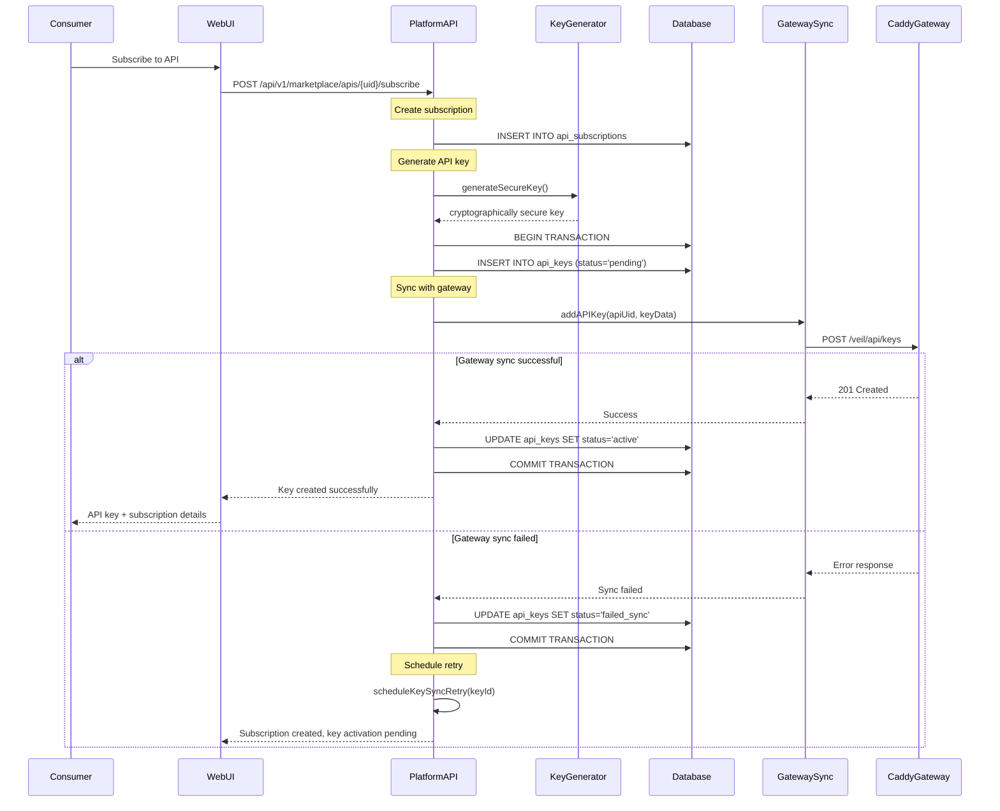
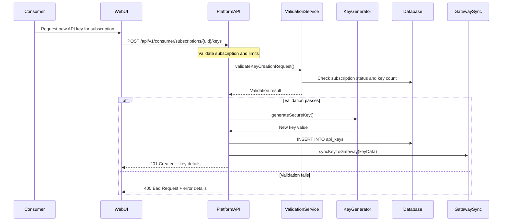
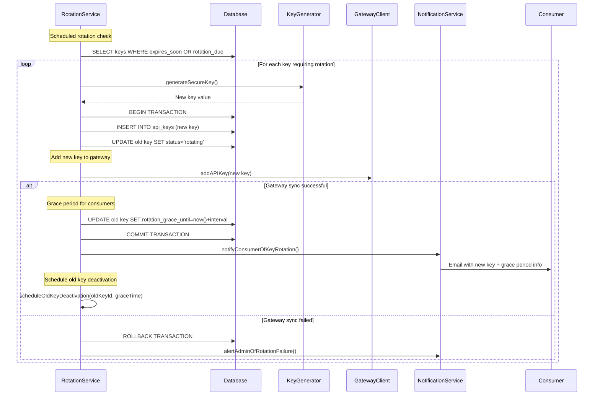

# API Key Lifecycle Management

## Overview

This document details the complete lifecycle of API keys in Veil, including generation, activation, rotation, expiration handling, and synchronization between the Platform API and Caddy Gateway.

## 1. API Key Lifecycle States

API keys progress through several states during their lifecycle:

- `pending` - Key created but not yet activated in gateway
- `active` - Key is active and accepting requests
- `suspended` - Temporarily disabled (quota exceeded, manual suspension)
- `expired` - Key has passed its expiration date
- `revoked` - Permanently disabled by user or admin
- `failed_sync` - Synchronization with gateway failed

## 2. Key Generation and Activation Flow

### 2.1 Subscription-Based Key Creation



### 2.2 Manual Key Creation



## 3. Key Synchronization Architecture

### 3.1 Real-time Synchronization

```typescript
export class KeySynchronizationService {
  async syncKeyToGateway(keyData: APIKeyData): Promise<SyncResult> {
    const maxRetries = 3;
    let attempt = 1;

    while (attempt <= maxRetries) {
      try {
        // Update key status to 'syncing'
        await this.apiKeyRepository.updateStatus(keyData.id, 'syncing');

        // Sync with gateway
        await this.gatewayClient.addAPIKey({
          path: `/${keyData.apiUid}/*`,
          api_keys: [{
            key: keyData.keyValue,
            name: keyData.name,
            is_active: keyData.isActive,
            expires_at: keyData.expiresAt?.toISOString(),
            subscription_id: keyData.subscriptionId,
            permissions: keyData.permissions
          }]
        });

        // Mark as active
        await this.apiKeyRepository.updateStatus(keyData.id, 'active');

        return { success: true, attempts: attempt };

      } catch (error) {
        if (attempt === maxRetries || !this.isRetryableError(error)) {
          // Final failure - mark as failed
          await this.apiKeyRepository.updateStatus(keyData.id, 'failed_sync', error.message);
          await this.notificationService.alertAdminOfSyncFailure(keyData, error);
          throw new KeySyncError('Failed to sync key after retries', error);
        }

        // Calculate exponential backoff
        const delay = Math.min(1000 * Math.pow(2, attempt - 1), 30000);
        await this.sleep(delay);
        attempt++;
      }
    }
  }

  async syncKeyStatusChange(keyId: number, newStatus: KeyStatus): Promise<void> {
    const key = await this.apiKeyRepository.findById(keyId);
    if (!key) {
      throw new NotFoundError('API key not found');
    }

    try {
      // Update gateway first
      await this.gatewayClient.updateAPIKeyStatus({
        path: `/${key.api.uid}/*`,
        api_key: key.keyValue,
        is_active: newStatus === 'active'
      });

      // Update database
      await this.apiKeyRepository.updateStatus(keyId, newStatus);

      // Clear relevant caches
      await this.cache.del(`key:${key.keyValue}`);
      await this.cache.del(`subscription_keys:${key.subscriptionId}`);

    } catch (error) {
      // Mark as out of sync for background reconciliation
      await this.apiKeyRepository.markOutOfSync(keyId, error.message);
      throw error;
    }
  }
}
```

### 3.2 Periodic Reconciliation Job

```typescript
export class KeyReconciliationService {
  async performReconciliation(): Promise<ReconciliationReport> {
    const report = {
      processed: 0,
      synced: 0,
      conflicts: 0,
      errors: 0,
      details: []
    };

    try {
      // Get all keys from database
      const dbKeys = await this.apiKeyRepository.findAllActive();

      // Get all keys from gateway (by API)
      const gatewayKeys = new Map();
      const activeAPIs = await this.apiRepository.findByStatus('active');

      for (const api of activeAPIs) {
        try {
          const keys = await this.gatewayClient.getAPIKeys(`/${api.uid}/*`);
          gatewayKeys.set(api.uid, keys);
        } catch (error) {
          report.errors++;
          report.details.push({
            type: 'gateway_fetch_error',
            apiUid: api.uid,
            error: error.message
          });
        }
      }

      // Compare and reconcile
      for (const dbKey of dbKeys) {
        report.processed++;

        const apiKeys = gatewayKeys.get(dbKey.api.uid) || [];
        const gatewayKey = apiKeys.find(gk => gk.key === dbKey.keyValue);

        if (!gatewayKey) {
          // Key missing from gateway
          if (dbKey.status === 'active') {
            await this.syncMissingKey(dbKey);
            report.synced++;
            report.details.push({
              type: 'key_missing_from_gateway',
              keyId: dbKey.id,
              action: 'synced'
            });
          }
        } else if (this.hasStatusConflict(dbKey, gatewayKey)) {
          // Status conflict
          await this.resolveStatusConflict(dbKey, gatewayKey);
          report.conflicts++;
          report.details.push({
            type: 'status_conflict',
            keyId: dbKey.id,
            dbStatus: dbKey.status,
            gatewayStatus: gatewayKey.is_active ? 'active' : 'inactive',
            action: 'resolved'
          });
        }
      }

      // Check for orphaned gateway keys
      for (const [apiUid, keys] of gatewayKeys.entries()) {
        for (const gatewayKey of keys) {
          const dbKey = dbKeys.find(dk =>
            dk.api.uid === apiUid && dk.keyValue === gatewayKey.key
          );

          if (!dbKey) {
            await this.cleanupOrphanedKey(apiUid, gatewayKey);
            report.synced++;
            report.details.push({
              type: 'orphaned_gateway_key',
              apiUid,
              keyValue: this.maskKey(gatewayKey.key),
              action: 'cleaned_up'
            });
          }
        }
      }

    } catch (error) {
      report.errors++;
      throw error;
    }

    return report;
  }

  private async resolveStatusConflict(
    dbKey: APIKeyWithDetails,
    gatewayKey: GatewayAPIKey
  ): Promise<void> {
    // Database is source of truth
    const shouldBeActive = dbKey.status === 'active' &&
                          (!dbKey.expiresAt || dbKey.expiresAt > new Date());

    if (gatewayKey.is_active !== shouldBeActive) {
      await this.gatewayClient.updateAPIKeyStatus({
        path: `/${dbKey.api.uid}/*`,
        api_key: dbKey.keyValue,
        is_active: shouldBeActive
      });
    }
  }
}
```

## 4. Key Rotation and Security

### 4.1 Automatic Key Rotation



### 4.2 Manual Key Rotation

```typescript
export class KeyRotationService {
  async rotateAPIKey(
    keyUid: string,
    userId: number,
    rotationReason: string
  ): Promise<RotationResult> {
    const existingKey = await this.apiKeyRepository.findByUid(keyUid);
    if (!existingKey || existingKey.subscription.userId !== userId) {
      throw new ForbiddenError('Key not found or access denied');
    }

    return this.database.transaction(async (trx) => {
      try {
        // Generate new key
        const newKeyValue = this.keyGenerator.generateSecure();

        // Create new key record
        const newKey = await this.apiKeyRepository.create({
          subscriptionId: existingKey.subscriptionId,
          keyValue: newKeyValue,
          name: `${existingKey.name} (rotated)`,
          isActive: false, // Will be activated after gateway sync
          expiresAt: existingKey.expiresAt,
          permissions: existingKey.permissions
        }, trx);

        // Mark old key as rotating
        await this.apiKeyRepository.updateStatus(
          existingKey.id,
          'rotating',
          rotationReason,
          trx
        );

        // Add new key to gateway
        await this.gatewayClient.addAPIKey({
          path: `/${existingKey.api.uid}/*`,
          api_keys: [{
            key: newKeyValue,
            name: newKey.name,
            is_active: true,
            expires_at: newKey.expiresAt?.toISOString(),
            subscription_id: newKey.subscriptionId
          }]
        });

        // Activate new key
        await this.apiKeyRepository.updateStatus(newKey.id, 'active', null, trx);

        // Set grace period for old key (24 hours)
        const graceUntil = new Date(Date.now() + 24 * 60 * 60 * 1000);
        await this.apiKeyRepository.setRotationGracePeriod(
          existingKey.id,
          graceUntil,
          trx
        );

        // Schedule old key deactivation
        await this.scheduler.scheduleTask('deactivate_rotated_key', {
          keyId: existingKey.id,
          executeAt: graceUntil
        });

        return {
          newKey: {
            uid: newKey.uid,
            keyValue: newKeyValue, // Only returned once
            name: newKey.name,
            createdAt: newKey.createdAt
          },
          oldKey: {
            uid: existingKey.uid,
            gracePeriodUntil: graceUntil
          },
          rotationReason
        };

      } catch (error) {
        // Transaction will auto-rollback
        throw new RotationError('Failed to rotate API key', error);
      }
    });
  }

  async deactivateRotatedKey(keyId: number): Promise<void> {
    const key = await this.apiKeyRepository.findById(keyId);
    if (!key || key.status !== 'rotating') {
      return; // Key already handled or not in rotation
    }

    try {
      // Remove from gateway
      await this.gatewayClient.deleteAPIKey({
        path: `/${key.api.uid}/*`,
        api_key: key.keyValue
      });

      // Mark as revoked
      await this.apiKeyRepository.updateStatus(keyId, 'revoked', 'rotation_complete');

    } catch (error) {
      // Mark as failed for manual cleanup
      await this.apiKeyRepository.updateStatus(
        keyId,
        'failed_sync',
        `Deactivation failed: ${error.message}`
      );
    }
  }
}
```

## 5. Expiration and Cleanup

### 5.1 Automatic Expiration Handling

```typescript
export class KeyExpirationService {
  async processExpiredKeys(): Promise<ExpirationReport> {
    const report = { processed: 0, deactivated: 0, warned: 0, errors: 0 };

    // Find keys expiring within warning period (7 days)
    const expiringKeys = await this.apiKeyRepository.findExpiringSoon(7);

    // Find already expired keys
    const expiredKeys = await this.apiKeyRepository.findExpired();

    // Send warnings for expiring keys
    for (const key of expiringKeys) {
      try {
        await this.sendExpirationWarning(key);
        report.warned++;
      } catch (error) {
        report.errors++;
      }
    }

    // Deactivate expired keys
    for (const key of expiredKeys) {
      try {
        await this.deactivateExpiredKey(key);
        report.deactivated++;
      } catch (error) {
        report.errors++;
      }
      report.processed++;
    }

    return report;
  }

  private async deactivateExpiredKey(key: APIKeyWithDetails): Promise<void> {
    if (key.status !== 'active') {
      return; // Already inactive
    }

    // Update gateway first
    await this.gatewayClient.updateAPIKeyStatus({
      path: `/${key.api.uid}/*`,
      api_key: key.keyValue,
      is_active: false
    });

    // Update database
    await this.apiKeyRepository.updateStatus(key.id, 'expired', 'automatic_expiration');

    // Clear cache
    await this.cache.del(`key:${key.keyValue}`);

    // Notify user
    await this.notificationService.notifyKeyExpired(key);
  }

  private async sendExpirationWarning(key: APIKeyWithDetails): Promise<void> {
    const daysUntilExpiry = Math.ceil(
      (key.expiresAt.getTime() - Date.now()) / (24 * 60 * 60 * 1000)
    );

    await this.notificationService.sendExpirationWarning({
      user: key.subscription.user,
      key: key,
      api: key.api,
      daysUntilExpiry
    });

    // Record warning sent
    await this.apiKeyRepository.recordExpirationWarning(key.id);
  }
}
```

## 6. Security Features

### 6.1 Key Generation

```typescript
export class SecureKeyGenerator {
  generateSecure(): string {
    // Use cryptographically secure random generation
    const bytes = crypto.randomBytes(32);

    // Base64url encoding (URL-safe, no padding)
    const key = bytes
      .toString('base64')
      .replace(/\+/g, '-')
      .replace(/\//g, '_')
      .replace(/=/g, '');

    // Add prefix for identification
    return `veil_${key}`;
  }

  generateWithChecksum(): string {
    const keyPart = this.generateSecure();
    const checksum = this.calculateChecksum(keyPart);
    return `${keyPart}_${checksum}`;
  }

  private calculateChecksum(key: string): string {
    return crypto
      .createHash('sha256')
      .update(key)
      .digest('hex')
      .substring(0, 8); // First 8 characters
  }

  validateKey(key: string): boolean {
    if (!key.startsWith('veil_')) {
      return false;
    }

    // If key has checksum, validate it
    if (key.includes('_') && key.split('_').length === 3) {
      const parts = key.split('_');
      const keyPart = `${parts[0]}_${parts[1]}`;
      const checksum = parts[2];
      return this.calculateChecksum(keyPart) === checksum;
    }

    return true; // Valid format
  }
}
```

### 6.2 Key Masking and Logging

```typescript
export class KeySecurityService {
  maskKey(key: string): string {
    if (key.length <= 8) {
      return '***';
    }

    const prefix = key.substring(0, 8);
    const suffix = key.substring(key.length - 4);
    return `${prefix}***${suffix}`;
  }

  logKeyOperation(
    operation: string,
    keyId: number,
    userId: number,
    metadata: any = {}
  ): void {
    this.auditLogger.info('api_key_operation', {
      operation,
      keyId,
      userId,
      timestamp: new Date().toISOString(),
      ipAddress: metadata.ipAddress,
      userAgent: metadata.userAgent,
      sessionId: metadata.sessionId
    });
  }

  async checkSuspiciousActivity(userId: number): Promise<SecurityAlert[]> {
    const alerts = [];

    // Check for excessive key generation
    const recentKeys = await this.apiKeyRepository.countRecentKeys(userId, 24); // Last 24 hours
    if (recentKeys > 10) {
      alerts.push({
        type: 'excessive_key_generation',
        severity: 'medium',
        details: `${recentKeys} keys generated in 24 hours`
      });
    }

    // Check for suspicious rotation patterns
    const recentRotations = await this.apiKeyRepository.countRecentRotations(userId, 1); // Last hour
    if (recentRotations > 5) {
      alerts.push({
        type: 'excessive_key_rotation',
        severity: 'high',
        details: `${recentRotations} rotations in 1 hour`
      });
    }

    return alerts;
  }
}
```

## 7. Monitoring and Metrics

### 7.1 Key Lifecycle Metrics

```typescript
export class KeyMetricsService {
  async getKeyMetrics(timeframe: string): Promise<KeyMetrics> {
    const [
      totalActive,
      totalExpired,
      rotationRate,
      syncFailures,
      usageStats
    ] = await Promise.all([
      this.getActiveKeyCount(),
      this.getExpiredKeyCount(timeframe),
      this.getRotationRate(timeframe),
      this.getSyncFailureRate(timeframe),
      this.getKeyUsageStats(timeframe)
    ]);

    return {
      totalActive,
      totalExpired,
      rotationRate,
      syncFailures,
      usageStats,
      healthScore: this.calculateHealthScore({
        syncFailures,
        rotationRate,
        expiredRate: totalExpired / totalActive
      })
    };
  }

  private calculateHealthScore(metrics: any): number {
    let score = 100;

    // Penalize sync failures
    score -= metrics.syncFailures * 10;

    // Penalize high expired key ratio
    if (metrics.expiredRate > 0.1) { // >10% expired
      score -= 20;
    }

    return Math.max(0, score);
  }
}
```

This comprehensive key lifecycle management system ensures secure, reliable, and efficient handling of API keys throughout their entire lifecycle while maintaining synchronization between all system components.