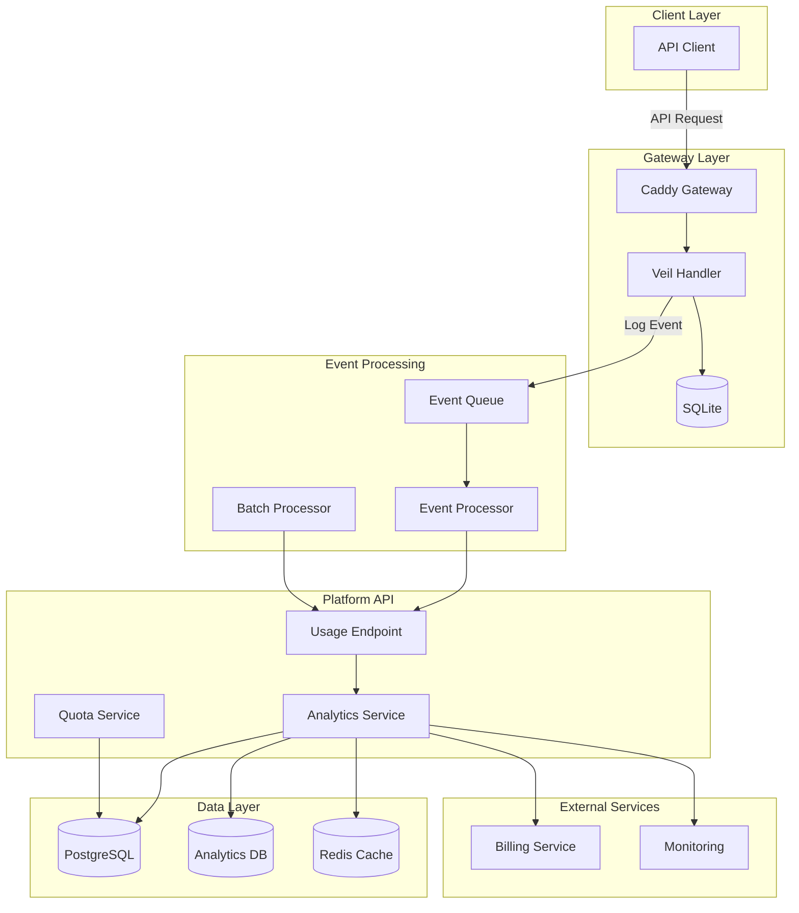
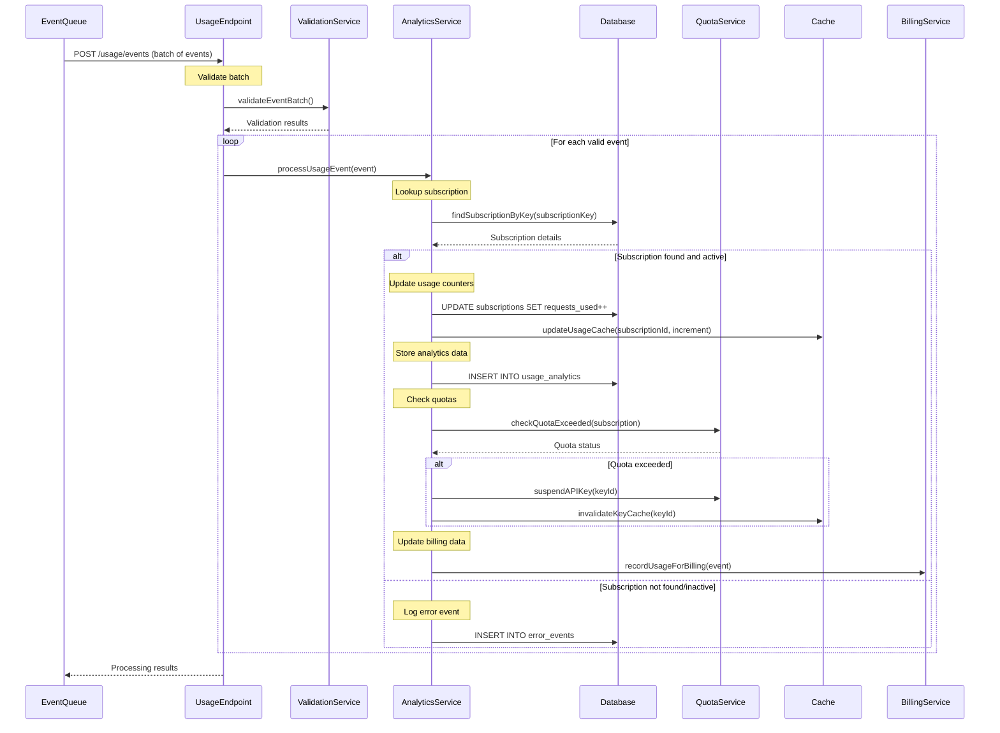

# Usage Tracking and Analytics Architecture

## Overview

This document details the complete usage tracking pipeline in Veil, covering event collection from the Caddy gateway, processing in the platform API, analytics storage, and real-time synchronization mechanisms.

## 1. Architecture Overview



## 2. Real-Time Event Flow

### 2.1 Request Processing and Event Generation

```mermaid
sequenceDiagram
    participant Client
    participant CaddyGateway
    participant SQLite
    participant EventQueue
    participant UpstreamAPI
    participant UsageEndpoint

    Client->>CaddyGateway: API Request + X-Subscription-Key

    note over CaddyGateway: Start request timer
    CaddyGateway->>SQLite: Validate API key
    SQLite-->>CaddyGateway: Key validation result

    alt Valid key
        CaddyGateway->>SQLite: Check rate limits
        SQLite-->>CaddyGateway: Rate limit status

        alt Within limits
            note over CaddyGateway: Forward request
            CaddyGateway->>UpstreamAPI: Proxied request
            UpstreamAPI-->>CaddyGateway: API response

            note over CaddyGateway: Calculate metrics
            CaddyGateway->>CaddyGateway: responseTime = endTime - startTime
            CaddyGateway->>CaddyGateway: calculateRequestSize(request)
            CaddyGateway->>CaddyGateway: calculateResponseSize(response)

            note over CaddyGateway: Generate usage event
            CaddyGateway->>EventQueue: Enqueue UsageEvent{
                id, apiPath, subscriptionKey,
                method, responseTime, statusCode,
                success, timestamp, requestSize, responseSize
            }

            CaddyGateway-->>Client: API response + usage headers
        else Rate limit exceeded
            CaddyGateway->>EventQueue: Enqueue RateLimitEvent
            CaddyGateway-->>Client: 429 Too Many Requests
        end
    else Invalid key
        CaddyGateway->>EventQueue: Enqueue AuthFailureEvent
        CaddyGateway-->>Client: 401 Unauthorized
    end

    note over EventQueue: Process events asynchronously
    EventQueue->>UsageEndpoint: POST /api/v1/usage/events (batch)
```

### 2.2 Usage Event Processing



## 3. Data Models and Storage

### 3.1 Usage Analytics Schema

```sql
-- Real-time usage tracking
CREATE TABLE api_usage_analytics (
    id SERIAL PRIMARY KEY,
    subscription_id INTEGER NOT NULL REFERENCES api_subscriptions(id),
    api_key_id INTEGER NOT NULL REFERENCES api_keys(id),
    api_id INTEGER NOT NULL REFERENCES apis(id),

    -- Request details
    method VARCHAR(10) NOT NULL,
    endpoint_path VARCHAR(500),
    status_code INTEGER NOT NULL,
    response_time_ms INTEGER NOT NULL,

    -- Size tracking
    request_size_bytes BIGINT DEFAULT 0,
    response_size_bytes BIGINT DEFAULT 0,

    -- Success/failure tracking
    is_successful BOOLEAN NOT NULL,
    error_type VARCHAR(50),
    error_message TEXT,

    -- Timestamps
    timestamp TIMESTAMP WITH TIME ZONE NOT NULL,
    processed_at TIMESTAMP WITH TIME ZONE DEFAULT NOW(),

    -- Indexing for performance
    INDEX idx_subscription_timestamp (subscription_id, timestamp),
    INDEX idx_api_timestamp (api_id, timestamp),
    INDEX idx_processed_at (processed_at)
);

-- Aggregated usage metrics (for performance)
CREATE TABLE usage_metrics_hourly (
    id SERIAL PRIMARY KEY,
    subscription_id INTEGER NOT NULL,
    api_id INTEGER NOT NULL,
    hour_bucket TIMESTAMP NOT NULL, -- Rounded to hour

    -- Aggregate metrics
    total_requests INTEGER NOT NULL DEFAULT 0,
    successful_requests INTEGER NOT NULL DEFAULT 0,
    failed_requests INTEGER NOT NULL DEFAULT 0,

    -- Performance metrics
    avg_response_time_ms DECIMAL(10,2),
    min_response_time_ms INTEGER,
    max_response_time_ms INTEGER,

    -- Data transfer
    total_data_transferred_bytes BIGINT DEFAULT 0,

    -- Error breakdown
    client_errors INTEGER DEFAULT 0, -- 4xx
    server_errors INTEGER DEFAULT 0, -- 5xx

    created_at TIMESTAMP DEFAULT NOW(),
    updated_at TIMESTAMP DEFAULT NOW(),

    UNIQUE(subscription_id, api_id, hour_bucket)
);
```

### 3.2 Event Processing Models

```typescript
// Core usage event structure
export interface UsageEvent {
  id: string;
  apiPath: string;
  subscriptionKey: string;
  method: string;
  responseTimeMs: number;
  statusCode: number;
  success: boolean;
  timestamp: Date;
  requestSize: number;
  responseSize: number;
  userAgent?: string;
  clientIp?: string;
  errorDetails?: {
    type: string;
    message: string;
    stack?: string;
  };
}

// Processed analytics record
export interface AnalyticsRecord {
  subscriptionId: number;
  apiId: number;
  apiKeyId: number;
  timestamp: Date;
  method: string;
  endpointPath: string;
  statusCode: number;
  responseTimeMs: number;
  requestSizeBytes: number;
  responseSizeBytes: number;
  isSuccessful: boolean;
  errorType?: string;
  errorMessage?: string;
}

// Quota tracking
export interface QuotaUsage {
  subscriptionId: number;
  currentPeriodStart: Date;
  requestsUsed: number;
  requestsLimit: number;
  dataTransferredBytes: number;
  dataTransferLimitBytes?: number;
  isOverLimit: boolean;
  nextResetAt: Date;
}
```

## 4. Synchronization Mechanisms

### 4.1 Real-time Usage Updates

```typescript
export class UsageTrackingService {
  async processUsageEvents(events: UsageEvent[]): Promise<ProcessingResult> {
    const results = { processed: 0, failed: 0, quotaExceeded: [] };

    // Process events in batches for performance
    const batches = this.chunkArray(events, 100);

    for (const batch of batches) {
      await this.database.transaction(async (trx) => {
        for (const event of batch) {
          try {
            // Find subscription by API key
            const subscription = await this.findSubscriptionByKey(
              event.subscriptionKey, trx
            );

            if (!subscription || subscription.status !== 'active') {
              await this.logInvalidKeyEvent(event, trx);
              results.failed++;
              continue;
            }

            // Update usage counters atomically
            await trx.raw(`
              UPDATE api_subscriptions
              SET requests_used = requests_used + 1,
                  last_used_at = NOW(),
                  updated_at = NOW()
              WHERE id = ?
            `, [subscription.id]);

            // Insert detailed analytics record
            await this.insertAnalyticsRecord({
              subscriptionId: subscription.id,
              apiId: subscription.apiId,
              apiKeyId: subscription.apiKeyId,
              ...this.mapEventToRecord(event)
            }, trx);

            // Update real-time cache
            await this.updateUsageCache(subscription.id, event);

            // Check quota limits
            const quotaStatus = await this.checkQuotas(subscription, trx);
            if (quotaStatus.exceeded) {
              results.quotaExceeded.push(subscription.id);
              await this.handleQuotaExceeded(subscription, trx);
            }

            results.processed++;

          } catch (error) {
            console.error(`Failed to process event ${event.id}:`, error);
            results.failed++;
          }
        }
      });
    }

    // Send quota exceeded notifications asynchronously
    if (results.quotaExceeded.length > 0) {
      await this.notifyQuotaExceeded(results.quotaExceeded);
    }

    return results;
  }

  private async updateUsageCache(subscriptionId: number, event: UsageEvent): Promise<void> {
    const cacheKey = `usage:${subscriptionId}`;

    // Update hourly usage cache
    const hourBucket = this.roundToHour(event.timestamp);
    const hourlyKey = `${cacheKey}:${hourBucket.getTime()}`;

    await Promise.all([
      // Increment total request count
      this.cache.incr(`${cacheKey}:total`),

      // Update hourly metrics
      this.cache.hincrby(hourlyKey, 'requests', 1),
      this.cache.hincrby(hourlyKey, event.success ? 'successful' : 'failed', 1),
      this.cache.hincrby(hourlyKey, 'data_transferred', event.requestSize + event.responseSize),

      // Set expiration for hourly cache (7 days)
      this.cache.expire(hourlyKey, 7 * 24 * 3600)
    ]);
  }
}
```

### 4.2 Quota Enforcement

```typescript
export class QuotaService {
  async checkQuotas(subscription: Subscription): Promise<QuotaStatus> {
    const now = new Date();
    const periodStart = this.getPeriodStart(subscription.billingCycle, now);

    // Get current usage for the billing period
    const currentUsage = await this.getUsageForPeriod(
      subscription.id,
      periodStart,
      now
    );

    const status: QuotaStatus = {
      subscriptionId: subscription.id,
      periodStart,
      periodEnd: this.getPeriodEnd(subscription.billingCycle, periodStart),
      requestsUsed: currentUsage.requests,
      requestsLimit: subscription.requestsLimit,
      dataTransferredBytes: currentUsage.dataTransferred,
      dataTransferLimitBytes: subscription.dataTransferLimit,
      isOverRequestLimit: currentUsage.requests >= subscription.requestsLimit,
      isOverDataLimit: subscription.dataTransferLimit ?
        currentUsage.dataTransferred >= subscription.dataTransferLimit : false
    };

    return status;
  }

  async enforceQuotaLimits(subscriptionId: number): Promise<void> {
    const subscription = await this.subscriptionRepository.findById(subscriptionId);
    const quotaStatus = await this.checkQuotas(subscription);

    if (quotaStatus.isOverRequestLimit || quotaStatus.isOverDataLimit) {
      // Suspend API keys for this subscription
      await this.suspendAPIKeys(subscriptionId);

      // Update gateway to reject requests
      await this.updateGatewayQuotaStatus(subscription.api.uid, false);

      // Send notifications
      await this.notificationService.sendQuotaExceededAlert(subscription);

      // Log quota violation
      await this.auditService.logQuotaViolation(subscription, quotaStatus);
    }
  }

  private async suspendAPIKeys(subscriptionId: number): Promise<void> {
    const apiKeys = await this.apiKeyRepository.findBySubscription(subscriptionId);

    // Update database
    await this.database.raw(`
      UPDATE api_keys
      SET is_active = false,
          suspended_reason = 'quota_exceeded',
          suspended_at = NOW()
      WHERE subscription_id = ? AND is_active = true
    `, [subscriptionId]);

    // Update gateway
    for (const key of apiKeys.filter(k => k.isActive)) {
      await this.gatewayService.updateAPIKeyStatus(
        key.api.uid,
        key.keyValue,
        false
      );
    }

    // Clear cache
    await this.cache.del(`keys:subscription:${subscriptionId}`);
  }
}
```

## 5. Analytics and Reporting

### 5.1 Real-time Metrics Dashboard

```typescript
export class AnalyticsService {
  async getDashboardMetrics(userId: number, timeframe: string): Promise<DashboardMetrics> {
    const subscriptions = await this.subscriptionRepository.findByUser(userId);
    const subscriptionIds = subscriptions.map(s => s.id);

    const [usage, topAPIs, trends] = await Promise.all([
      this.getCurrentUsage(subscriptionIds, timeframe),
      this.getTopAPIsByUsage(subscriptionIds, timeframe, 5),
      this.getUsageTrends(subscriptionIds, timeframe)
    ]);

    return {
      totalRequests: usage.totalRequests,
      successRate: (usage.successfulRequests / usage.totalRequests) * 100,
      avgResponseTime: usage.avgResponseTime,
      dataTransferred: usage.totalDataTransferred,
      topAPIs,
      trends,
      quotaStatus: await this.getQuotaStatus(subscriptionIds)
    };
  }

  async getUsageTrends(
    subscriptionIds: number[],
    timeframe: string
  ): Promise<UsageTrend[]> {
    const query = `
      SELECT
        DATE_TRUNC('hour', timestamp) as hour,
        COUNT(*) as requests,
        COUNT(*) FILTER (WHERE is_successful = true) as successful_requests,
        AVG(response_time_ms) as avg_response_time,
        SUM(request_size_bytes + response_size_bytes) as data_transferred
      FROM api_usage_analytics
      WHERE subscription_id = ANY($1)
        AND timestamp >= NOW() - INTERVAL '${timeframe}'
      GROUP BY hour
      ORDER BY hour ASC
    `;

    return await this.database.raw(query, [subscriptionIds]);
  }
}
```

### 5.2 Usage Export and Data Pipeline

```typescript
export class UsageExportService {
  async exportUsageData(
    subscriptionIds: number[],
    format: 'json' | 'csv' | 'parquet',
    timeRange: DateRange
  ): Promise<ExportResult> {
    const query = this.buildExportQuery(subscriptionIds, timeRange);
    const data = await this.database.raw(query);

    switch (format) {
      case 'csv':
        return this.exportToCSV(data);
      case 'json':
        return this.exportToJSON(data);
      case 'parquet':
        return this.exportToParquet(data);
    }
  }

  // Streaming export for large datasets
  async streamUsageData(
    subscriptionIds: number[],
    timeRange: DateRange,
    callback: (chunk: UsageRecord[]) => Promise<void>
  ): Promise<void> {
    const chunkSize = 10000;
    let offset = 0;

    while (true) {
      const chunk = await this.getUsageChunk(
        subscriptionIds,
        timeRange,
        offset,
        chunkSize
      );

      if (chunk.length === 0) break;

      await callback(chunk);
      offset += chunkSize;
    }
  }
}
```

## 6. Performance Optimizations

### 6.1 Batch Processing Strategy

```go
// Caddy Gateway - Event Queue Implementation
type EventQueue struct {
    events     chan UsageEvent
    batchSize  int
    flushInterval time.Duration
    httpClient *http.Client
    endpoint   string
    mu         sync.RWMutex
    stopped    bool
}

func (eq *EventQueue) Start() error {
    ticker := time.NewTicker(eq.flushInterval)
    batch := make([]UsageEvent, 0, eq.batchSize)

    go func() {
        defer ticker.Stop()

        for {
            select {
            case event := <-eq.events:
                batch = append(batch, event)

                if len(batch) >= eq.batchSize {
                    eq.flushBatch(batch)
                    batch = batch[:0] // Reset batch
                }

            case <-ticker.C:
                if len(batch) > 0 {
                    eq.flushBatch(batch)
                    batch = batch[:0]
                }

            case <-eq.ctx.Done():
                // Flush remaining events before shutdown
                if len(batch) > 0 {
                    eq.flushBatch(batch)
                }
                return
            }
        }
    }()

    return nil
}

func (eq *EventQueue) flushBatch(events []UsageEvent) {
    payload := EventBatch{
        Events:    events,
        Timestamp: time.Now(),
        BatchId:   uuid.New().String(),
    }

    // Retry with exponential backoff
    maxRetries := 3
    for attempt := 1; attempt <= maxRetries; attempt++ {
        if err := eq.sendBatch(payload); err != nil {
            if attempt == maxRetries {
                log.Printf("Failed to send batch after %d attempts: %v", maxRetries, err)
                // Could write to dead letter queue here
                break
            }

            backoff := time.Duration(attempt) * time.Second
            time.Sleep(backoff)
            continue
        }
        break
    }
}
```

### 6.2 Caching Strategy

```typescript
export class CachedUsageService {
  private readonly CACHE_TTL = {
    REALTIME: 60,      // 1 minute
    HOURLY: 3600,      // 1 hour
    DAILY: 86400,      // 24 hours
    QUOTA: 300         // 5 minutes
  };

  async getUsageStats(subscriptionId: number, period: string): Promise<UsageStats> {
    const cacheKey = `usage_stats:${subscriptionId}:${period}`;

    // Try cache first
    const cached = await this.cache.get(cacheKey);
    if (cached) {
      return JSON.parse(cached);
    }

    // Calculate from database
    const stats = await this.calculateUsageStats(subscriptionId, period);

    // Cache based on period granularity
    const ttl = this.getCacheTTL(period);
    await this.cache.setex(cacheKey, ttl, JSON.stringify(stats));

    return stats;
  }

  private getCacheTTL(period: string): number {
    switch (period) {
      case 'realtime': return this.CACHE_TTL.REALTIME;
      case 'hour': return this.CACHE_TTL.HOURLY;
      case 'day': return this.CACHE_TTL.DAILY;
      default: return this.CACHE_TTL.HOURLY;
    }
  }
}
```

This comprehensive usage tracking architecture ensures accurate billing, real-time quota enforcement, and detailed analytics while maintaining high performance and reliability.