# Veil API Entities

This directory contains the core entity types and schemas for the Veil API platform. The entities are organized into logical domains and use TypeScript for type definitions and Zod for runtime validation, covering API management, user/project structures, and a comprehensive billing system.

## Entity Relationship Diagram

```mermaid
erDiagram
    %% API Core Entities
    Api ||--o{ ApiGroup : "contains"
    ApiGroup ||--o{ ApiEndpoint : "contains"
    ApiEndpoint ||--o{ RouteParameter : "has"
    Api ||--o{ QualityMetric : "has"
    Api ||--o{ ProjectAllowedAPI : "allowed in"

    %% Project & User Entities
    User ||--o{ Project : "owns"
    Project ||--o{ ProjectAcl : "has access control for"
    User ||--o{ ProjectAcl : "is subject of"
    Project ||--o{ ProjectAllowedAPI : "defines allowed"
    User ||--o{ UserAttribute : "has attributes"
    User ||--o{ UserMetadata : "has metadata"
    User ||--o{ UserAuthorization : "has authorization"
    User ||--o{ Subscription : "has subscriptions"
    User ||--o{ Invoice : "receives invoices for"
    User ||--o{ Payment : "makes payments"
    User ||--o{ Wallet : "has wallet"

    %% Gateway Entities
    Gateway ||--|| Tenant : "belongs to"
    Gateway ||--|| GatewayTemplate : "uses template"
    GatewayTemplate ||--o{ GatewayHeader : "defines headers"

    %% Billing Core Entities
    Api ||--o{ BillingPlan : "offers plans"
    BillingPlan ||--o{ BillingPlanVersion : "has versions"
    BillingPlanVersion ||--o{ BillingLimit : "defines limits"
    BillingLimit ||--|| BillingItem : "references item"
    BillingPlanVersion ||--o{ EnabledBillingFeature : "enables features"
    EnabledBillingFeature ||--|| BillingFeature : "references feature"

    %% Subscription Entities
    User ||--o{ Subscription : "holds"
    Subscription }|--|| BillingPlanVersion : "subscribes to"
    Subscription ||--o{ SubscriptionLineItem : "contains line items"
    SubscriptionLineItem }|--|| BillingPlanVersion : "references plan version (indirectly)"
    SubscriptionLineItem }|--|| BillingItem : "references item (often)"
    Subscription ||--o{ SubscriptionPause : "can be paused by"
    Subscription ||--o{ Invoice : "generates invoices"

    %% Invoice Entities
    Invoice ||--o{ InvoiceLineItem : "contains line items"
    InvoiceLineItem }o--|| SubscriptionLineItem : "derived from"
    Invoice ||--o{ Payment : "is paid by"
    Invoice ||--o{ WalletTransaction : "can be paid by credits via"

    %% Payment Entities
    Payment ||--o{ PaymentAttempt : "tracks attempts"
    Payment }o--|| Invoice : "pays for (usually)"
    Payment ||--o{ WalletTransaction : "can trigger credit transaction"

    %% Wallet Entities
    User ||--o{ Wallet : "owns"
    Wallet ||--o{ WalletTransaction : "tracks transactions"
    WalletTransaction }o--|| Invoice : "references (e.g., credit payment)"
    WalletTransaction }o--|| Payment : "references (e.g., top-up)"

    %% --- Entity Definitions ---

    Api {
        string id PK
        string name
        string title
        ApiVisibility visibility
        ApiPricing pricing
        ApiStatus status
        string categoryId FK
    }

    ApiGroup {
        string id PK
        string name
        string apiId FK
    }

    ApiEndpoint {
        string id PK
        string name
        string method
        string route
        string groupId FK
    }

    RouteParameter {
        string id PK
        string name
        string endpointId FK
        ParameterType paramType
        ParameterCondition condition
        ParameterStatus status
    }

    QualityMetric {
        string id PK
        string apiId FK
        number score
    }

    Project {
        string id PK
        string name
        string userId FK
    }

    ProjectAcl {
        string id PK
        string projectId FK
        string userId FK
        string role
    }

    ProjectAllowedAPI {
        string id PK
        string projectId FK
        string apiId FK
    }

    User {
        string id PK
        string username
        string email
        UserType type
    }

    UserAttribute {
        string id PK
        string userId FK
        string attributeName
        string attributeValue
    }

    UserMetadata {
        string id PK
        string userId FK
        string attributeName
        string attributeValue
    }

    UserAuthorization {
        string id PK
        string userId FK
        string key
        string status
    }

    Gateway {
        string id PK
        string dns
        GatewayStatus status
        string tenantId FK
    }

    GatewayTemplate {
        string id PK
        string name
        string urlPattern
    }

    GatewayHeader {
        string id PK
        string gatewayTemplateId FK
        string paramName
        string paramValue
    }

    Tenant {
        string id PK
        string domain
        string name
    }

    BillingPlan {
        string id PK
        string apiId FK
        string name
        BillingPlanVisibility visibility
    }

    BillingPlanVersion {
        string id PK
        string billingPlanId FK
        string name
        BillingPeriod period
        number price
        BillingPlanVersionStatus status
    }

    BillingItem {
        string id PK
        string name
        BillingItemType type
    }

    BillingLimit {
        string id PK
        string billingPlanVersionId FK
        string billingItemId FK
        BillingPeriod period
        number amount
    }

    BillingFeature {
        string id PK
        string name
        string type
    }

    EnabledBillingFeature {
        string id PK
        string billingFeatureId FK
        string billingPlanVersionId FK
        boolean isEnabled
        number usageLimit
        BillingPeriod usageResetPeriod
    }

    Subscription {
        string id PK
        string customerId FK "User.id"
        string billingPlanVersionId FK
        SubscriptionStatus status
        SubscriptionPauseState pauseState
        string activePauseId FK
        datetime currentPeriodStart
        datetime currentPeriodEnd
    }

    SubscriptionLineItem {
        string id PK
        string subscriptionId FK
        string customerId FK "User.id"
        string priceId FK "BillingPlanVersion.id (or future Price entity)"
        SubscriptionLineItemInvoiceCadence invoiceCadence
        number quantity
    }

    SubscriptionPause {
        string id PK
        string subscriptionId FK
        SubscriptionPauseStatus status
        datetime pauseStart
        datetime pauseEnd
    }

    Invoice {
        string id PK
        string customerId FK "User.id"
        string subscriptionId FK
        InvoiceType invoiceType
        InvoiceStatus invoiceStatus
        InvoicePaymentStatus paymentStatus
        number amountDue
        number amountPaid
        datetime periodStart
        datetime periodEnd
    }

    InvoiceLineItem {
        string id PK
        string invoiceId FK
        string subscriptionLineItemId FK
        number amount
        number quantity
        datetime periodStart
        datetime periodEnd
    }

    Payment {
        string id PK
        string tenantId FK
        PaymentDestinationType destinationType
        string destinationId FK "Invoice.id (usually)"
        PaymentMethodType paymentMethodType
        number amount
        PaymentStatus paymentStatus
    }

    PaymentAttempt {
        string id PK
        string paymentId FK
        number attemptNumber
        PaymentAttemptStatus paymentStatus
    }

    Wallet {
        string id PK
        string customerId FK "User.id"
        number balance
        number creditBalance
        string currency
    }

    WalletTransaction {
        string id PK
        string walletId FK
        WalletTransactionType type
        WalletTransactionSubtype subtype
        WalletTransactionStatus status
        number amount
        number creditsAvailable
        datetime expiryDate
        WalletTransactionReferenceType referenceType
        string referenceId
    }
```



## Directory Structure

- 📁 **api/** - API, API Group, and API Endpoint entities
- 📁 **billing/** - Comprehensive billing entities (Plans, Features, Items, Limits, Subscriptions, Invoices, Payments, Wallets, etc.)
- 📁 **endpoint/** - Endpoint configuration details (moved under `api/` conceptually, but kept separate for clarity)
- 📁 **gateway/** - Gateway, Template, Header, and Tenant entities
- 📁 **parameter/** - Route Parameter definition entities
- 📁 **project/** - Project and Project ACL entities
- 📁 **quality/** - API Quality metrics entities
- 📁 **user/** - User, User Attribute, User Metadata, and User Authorization entities

## Usage

All entities are available as both TypeScript types and Zod schemas:

```typescript
import { Api, apiSchema, Subscription, subscriptionSchema } from './entities';

// Use as TypeScript type
const api: Api = {
  // ... api data
};
const sub: Subscription = {
  // ... subscription data
};

// Validate at runtime
const validatedApi = apiSchema.parse(api);
const validatedSub = subscriptionSchema.parse(sub);
```

## Validation

All entities have corresponding Zod schemas that provide runtime validation:

- UUID validation for IDs
- URL validation for links
- Number validations (positive, non-negative, integer)
- Enum validations for status, type, period, etc.
- Optional fields handling
- Nested object validation (where applicable)
- Array validations (where applicable)
- Custom refinements (e.g., ensuring periodEnd >= periodStart)

## Contributing

When adding new entities or modifying existing ones:

1. Create/Update TypeScript types in the relevant domain's `types.ts`
2. Create/Update Zod schemas in the relevant domain's `schemas.ts`
3. Export types and schemas in the domain's `index.ts`
4. **Update the ERD in this README** to reflect changes
5. Add/Update domain-specific documentation in the folder's README
